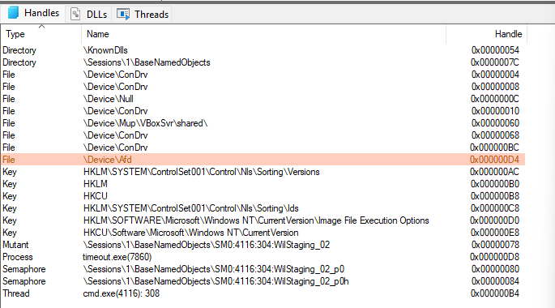
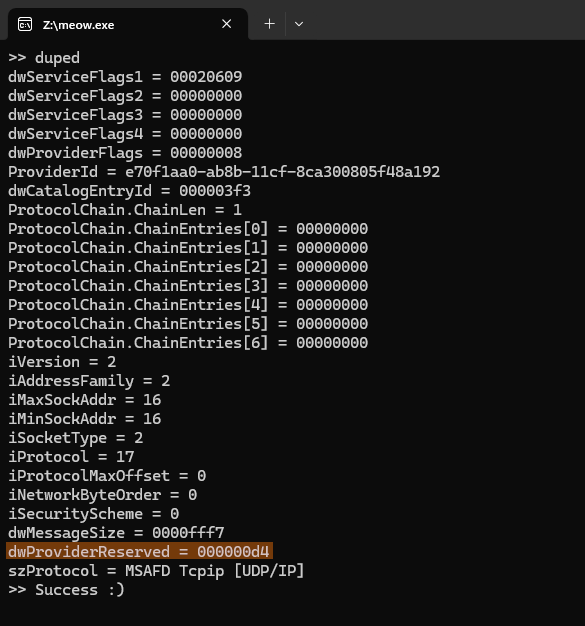

WinAPI represents most "things" as `HANDLE`s: files, cross-process mutexes, threads, jobs, etc. Sockets, however, are a notable exception: while on Unix systems they're no different from files, Windows denotes them by a different type: `SOCKET`.

The reason for this is that sockets are a userland abstraction provided by Winsock2, rather than a kernel primitive. At least on paper. As such, operating on them as on handles is incorrect. For example, MSDN says that even if casting a `SOCKET` to `HANDLE` and calling `DuplicateHandle` works, it [messes up some refcounts](https://learn.microsoft.com/en-us/windows/win32/api/handleapi/nf-handleapi-duplicatehandle#:~:text=Also%2C%20using%20DuplicateHandle%20interferes%20with%20internal%20reference%20counting%20on%20the%20underlying%20object).

This post explores just how far this difference lies, and when you can get away with using handle methods for sockets when you have to.


### DuplicateHandle

Today I'll focus on `DuplicateHandle` in particular, because it's by far the most painful API to avoid. It's the only way to freely move handles across processes in WinAPI:

```c
BOOL DuplicateHandle(
  [in]  HANDLE   hSourceProcessHandle,
  [in]  HANDLE   hSourceHandle,
  [in]  HANDLE   hTargetProcessHandle,
  [out] LPHANDLE lpTargetHandle,
  [in]  DWORD    dwDesiredAccess,
  [in]  BOOL     bInheritHandle,
  [in]  DWORD    dwOptions
);
```

`DuplicateHandle` takes source and target process handles, so you can not only inject handles into other processes, but also steal them. I use this heavily in my IPC library, which allows processes to send and receive handles through streams, [UDS-style](https://en.wikipedia.org/wiki/Unix_domain_socket). I&nbsp;inject handles into a broker process on send and steal them from the broker on receive. For instance, this allows a work-stealing process pool to operate on handles.

Winsock2 does offer a function to duplicate sockets -- `WSADuplicateSocketW` -- but its API is much more limited than `DuplicateHandle`. Compare:

```c
int WSAAPI WSADuplicateSocketW(
  [in]  SOCKET              s,
  [in]  DWORD               dwProcessId,
  [out] LPWSAPROTOCOL_INFOW lpProtocolInfo
);
```

First, it doesn't take a source process, so you can't steal sockets. (Technically you can use `CreateRemoteThread`, but it's less reliable, slow, and requires synchronization and more privileges.) That means that you can't use the broker pattern and need to know which process you're passing the socket to ahead of time.

Second, it takes the *PID* of the target process, not the handle, which means it has to reopen the process, asserting the `PROCESS_DUP_HANDLE` access right. This goes against the principle of least privilege -- normally you can open a process and then drop the `PROCESS_DUP_HANDLE` right without invalidating already open process handles, or pass the handle to a less privileged context, but here you can't do that. (It's also racy unless you protect against PID reuse by keeping a process handle around.)

My goal for today is to achieve the effect of `WSADuplicateSocketW` through a low-level interface that can be made to work like `DuplicateHandle`.


### How it's made

The reason `DuplicateHandle` is (said to be) broken is that sockets are a userland abstraction. But what does that really mean?

Windows supports custom socket implementations, called [Layered Service Providers](https://en.wikipedia.org/wiki/Layered_Service_Provider), used by e.g. some proxies. There are two types of LSPs: IFS (installable file system) and non-IFS. IFS sockets are [real OS-level handles](https://news.ycombinator.com/item?id=24969257), while non-IFS sockets are purely userland-side. Non-IFS LSPs are a nightmare: they work by redirecting Winsock2 methods in userland, like `WSARecv`, which means that they completely fail when passed to native APIs, like `ReadFile`. `WSADuplicateSocketW` for such sockets works because it's one of the methods they redirect.

But it seems like Microsoft got fed up with crashes from broken non-IFS implementations, and LSPs have been deprecated entirely for 10 years now. So we can reasonably assume all sockets to be IFS-style native handles. In fact, multiple popular programs already do so: [Rust's tokio](https://github.com/tokio-rs/mio/blob/1e79434244eed630a1ee7f227117960c6296e7f3/src/sys/windows/selector.rs#L146) treats all sockets as IFS handles, and [Zig](https://ziglang.org/download/0.16.0/release-notes.html#Windows-Networking-Without-ws2_32dll) uses a networking implementation that bypasses Winsock2 entirely.

Even MSDN mentions that `SOCKET` values [can be accepted by some handle APIs](https://learn.microsoft.com/en-us/windows/win32/api/winsock2/nf-winsock2-wsasocketw):

> The `GetHandleInformation` function can be used to determine if a socket handle was created with the `WSA_FLAG_NO_HANDLE_INHERIT` flag set.

So why shouldn't `DuplicateHandle` be used for `SOCKET`s? Well, even though most socket details are maintained by the kernel, Winsock2 still has some internal bookkeeping. Winsock2 keeps a mapping from socket handles to that data, and creating sockets without going through Winsock2 doesn't populate it, which can cause issues. Similarly, closing socket handles directly doesn't free it.


### Bookkeeping

We can inspect the data stored in userland by looking closer at the `WSADuplicateSocketW` API. The official way to pass sockets across processes involves running `WSADuplicateSocketW` to obtain a blob representing a socket, and then reassembling it on the other end with `WSASocketW`. Given that no one would trust userland to pass across kernel data, we can speculate that this blob contains exactly the userland accounting data, plus some way to access the kernel handle.

Since `WSADuplicateSocketW` takes the destination PID, it clearly somehow makes the kernel object accessible to the target process. I can see two possibilities:

- Perhaps the kernel maintains a list of processes that may access each socket, the blob contains a "token" to the handle, and `WSASocketW` materializes that token into a handle.
- Or perhaps it's much simpler and `WSADuplicateSocketW` just injects the handle directly into the target process.

My friend [Yuki](https://codeberg.org/sylfn/) wrote a script to check which hypothesis is true:

```c
// ...
SOCKET sock;
if (INVALID_SOCKET == (sock = socket(AF_INET, SOCK_DGRAM, IPPROTO_UDP))) {
    printf("Error at socket(): %d\n", WSAGetLastError());
    goto err_wsa;
}

// ...

PROCESS_INFORMATION pi;
if (0 == CreateProcessA(
    NULL, "cmd /c timeout /nobreak -1 >nul",
    NULL, NULL, FALSE, 0, NULL, NULL, &si, &pi
)) {
    printf("Error at CreateProcess(): %lu\n", GetLastError());
    goto err_wsa;
}
puts(">> forked");

getch();

WSAPROTOCOL_INFOW wpi;
ZeroMemory(&wpi, sizeof(wpi));
if (SOCKET_ERROR == WSADuplicateSocketW(sock, pi.dwProcessId, &wpi)) {
    printf("Error at WSADuplicateSocket(): %d\n", WSAGetLastError());
    goto err_wsa;
}
puts(">> duped");
// ...
```

A quick experiment shows that a new handle appears in the target process after `WSADuplicateSocketW` even without the corresponding `WSASocketW` in the receiver, so the latter guess is correct:



The `\Device\Afd` path denotes the <s>Another Fucking Driver</s> Ancillary Function Driver, which implements sockets.

If we look at the blob, we can actually find the number that denotes the handle:



The blob structure [is documented](https://learn.microsoft.com/en-us/windows/win32/api/winsock2/ns-winsock2-wsaprotocol_infow), and if we look at the docs, we'll find that `dwProviderReserved` is pretty much the only opaque field, and it's the only place where a compliant IFS LSP would be able to store a handle.

In fact, [if we look at the docs for implementing providers](https://learn.microsoft.com/en-us/windows/win32/winsock/shared-sockets-in-the-spi-2), we'll find exactly this advice:

> The `dwProviderReserved` member of the `WSAPROTOCOL_INFO` structure is available for the service provider's use, and may be used to store any useful context information, including a duplicated handle.


### Implementation

So here's how `WSADuplicateSocketW` seems to be implemented at the moment:

1. Copy process-independent userland data into the blob.
2. Inject the handle `(HANDLE)socket` into the target process.
3. Copy the resulting handle into `dwProviderReserved`.

On the receiving side, `WSASocketW` undoes this process:

1. Extract the handle from `dwProviderReserved`.
2. Copy userland data from the blob, associating it with the handle.
3. Return `(SOCKET)handle`.


### Lazy init

But there's a small hitch.

Since using `DuplicateHandle` doesn't populate userland data, kernel APIs like `ReadFile` still work on the resulting socket, but people say that Winsock2 APIs like `WSARecv` return `WSAENOTSOCK`. But then I [saw a comment](https://internals.rust-lang.org/t/expose-api-to-trigger-wsastartup/19504) that contradicts this claim: it shows that `WSAAccept` works on an inherited socket handle without passing the userland data by hand. So I wrote a test to figure out where it gets the data from:

```rust
// Not shown: perform a TCP connection to load all the necessary DLLs and initialize globals

// `DuplicateHandle` a TCP socket
let clone_handle = unsafe {
    BorrowedHandle::borrow_raw(socket.as_raw_socket() as RawHandle)
        .try_clone_to_owned()
        .expect("clone")
        .into_raw_handle() as RawSocket
};
drop(socket);
let socket = unsafe { TcpListener::from_raw_socket(clone_handle) };

// Attempt #1 to accept a connection on the new socket
let (mut connection, _) = socket.accept().unwrap();
connection.write_all(b"Hello, world!\n").unwrap();
connection.flush().unwrap();
drop(connection);

// Attempt #2 to accept a connection on the new socket
let (mut connection, _) = socket.accept().unwrap();
```

Since Winsock2 is a thin layer on top of AFD, I used [NtTrace](https://github.com/rogerorr/NtTrace) to see which `ioctl`s it runs. Attempt #2 gives a clean trace:

```c
NtDeviceIoControlFile(FileHandle=0xfc, Event=0xec, ApcRoutine=null, ApcContext=null, IoStatusBlock=0xac2e95f2f0 [0/0x14], IoControlCode=0x0001200c, InputBuffer=null, InputBufferLength=0, OutputBuffer=0xac2e95f5c0, OutputBufferLength=0x14) => 0
NtCreateFile(FileHandle=0xac2e95f100 [0x100], DesiredAccess=WRITE_DAC|SYNCHRONIZE|GENERIC_READ|GENERIC_WRITE, ObjectAttributes="\Device\Afd\Endpoint", IoStatusBlock=0xac2e95f130 [0/0], AllocationSize=null, FileAttributes=0, ShareAccess=3, CreateDisposition=3, CreateOptions=0, EaBuffer=0xac2e95f180, EaLength=0x39) => 0
NtDeviceIoControlFile(FileHandle=0xfc, Event=0xec, ApcRoutine=null, ApcContext=null, IoStatusBlock=0xac2e95f2f0 [0/0], IoControlCode=0x00012010, InputBuffer=0xac2e95f2b8, InputBufferLength=0x10, OutputBuffer=null, OutputBufferLength=0) => 0
```

There are two ioctls here: `0x0001200c` (`IOCTL_AFD_WAIT_FOR_LISTEN`) and `0x00012010` (`IOCTL_AFD_ACCEPT`).

Let's see if attempt #1 does anything different:

```c
NtQueryObject(ObjectHandle=0xfc, ObjectInformationClass=4 [ObjectHandleFlagInformation], ObjectInformation=0xac2e95f5d0, Length=2, ReturnLength=null) => 0
NtDeviceIoControlFile(FileHandle=0xfc, Event=0xec, ApcRoutine=null, ApcContext=null, IoStatusBlock=0xac2e95f078 [0/0xa8], IoControlCode=0x00012043, InputBuffer=null, InputBufferLength=0, OutputBuffer=0xac2e95f0a0, OutputBufferLength=0x100) => 0
NtDeviceIoControlFile(FileHandle=0xfc, Event=0xec, ApcRoutine=null, ApcContext=null, IoStatusBlock=0xac2e95efc0 [0/0x10], IoControlCode=0x00012037, InputBuffer=0xac2e95efe0, InputBufferLength=4, OutputBuffer=0xac2e95efb0, OutputBufferLength=0x10) => 0
NtDeviceIoControlFile(FileHandle=0xfc, Event=0xec, ApcRoutine=null, ApcContext=null, IoStatusBlock=0xac2e95f2f0 [0/0x14], IoControlCode=0x0001200c, InputBuffer=null, InputBufferLength=0, OutputBuffer=0xac2e95f5c0, OutputBufferLength=0x14) => 0
NtCreateFile(FileHandle=0xac2e95f100 [0x110], DesiredAccess=WRITE_DAC|SYNCHRONIZE|GENERIC_READ|GENERIC_WRITE, ObjectAttributes="\Device\Afd\Endpoint", IoStatusBlock=0xac2e95f130 [0/0], AllocationSize=null, FileAttributes=0, ShareAccess=3, CreateDisposition=3, CreateOptions=0, EaBuffer=0xac2e95f180, EaLength=0x39) => 0
NtDeviceIoControlFile(FileHandle=0xfc, Event=0xec, ApcRoutine=null, ApcContext=null, IoStatusBlock=0xac2e95f2f0 [0/0], IoControlCode=0x00012010, InputBuffer=0xac2e95f2b8, InputBufferLength=0x10, OutputBuffer=null, OutputBufferLength=0) => 0
```

We can recognize `IOCTL_AFD_WAIT_FOR_LISTEN` and `IOCTL_AFD_ACCEPT` here, too, but prior to that there are a couple more requests:

- `NtQueryObject(ObjectHandleFlagInformation)`, which outputs whether the handle is a) inheritable, b) protected from close.
- ioctls `0x00012043` (`IOCTL_AFD_GET_CONTEXT`) and `0x00012037` (`IOCTL_AFD_GET_TDI_HANDLES`).

So on modern Windows versions, there is actually no downside to creating a socket while bypassing Winsock2 -- it will lazily fetch the necessary information, supposedly mostly via `IOCTL_AFD_GET_CONTEXT`.

Of course, you still need to use `closesocket` to make sure the userland data is freed, so if you use `DuplicateHandle`, avoid `DUPLICATE_CLOSE_SOURCE` unless you know that the source process has never passed the socket to Winsock2.


### Patterns

Let's see how this can be applied to some common problems.

Socket inheritance just works, and so does stealing a socket from another process without cooperation.

The broker pattern can be directly implemented with `DuplicateHandle`: the sender copies the handle into the broker with `DuplicateHandle` and the receiver steals it from the broker with `DUPLICATE_CLOSE_SOURCE`, which is fine because the broker doesn't pass it to Winsock2. The sender, however, needs to use `closesocket` instead of `DUPLICATE_CLOSE_SOURCE`.


### Emulators

I also checked how non-Microsoft Winsock2 implementations handle this.

Wine [implements `WSADuplicateSocketW`](https://github.com/wine-mirror/wine/blob/738aac8c6edf775d19e6e6d2a93f2dfb60686313/dlls/ws2_32/socket.c#L842-L846) similarly to Windows, but stores the handle in `dwServiceFlags3` instead of `dwProviderReserved`. This is inconsistent, but all Winsock2 functions forward requests to the "kernel" with `NtDeviceIoControlFile`, and there seems to be no userland bookeeping, so `DuplicateHandle` works all the same.

`WSADuplicateSocketW` from ReactOS [stores](https://github.com/reactos/reactos/blob/51fcee37bc627642b638b3f8c59a48de6791fff0/dll/win32/msafd/misc/dllmain.c#L449) the socket handle in `dwServiceFlags4`, but it also stores a handle to shared memory in `dwServiceFlags3`. It implements more parts of AFD in userland than both Windows and Wine. This is frankly concerning, e.g. this allows one process holding a socket to crash another process. The memory is mostly used to share the current socket connection status and the error code for `SO_ERROR` (with no synchronization, if I may add), which to me looks broken by design. Information doesn't seem to be fetched lazily. So this fails on ReactOS.


### Compatibility

Let's sum up the information we have.

MS documents that some handle APIs can be used on sockets, and has deprecated mechanisms that can break this feature. It advises LSP implementers to implement socket duplication by duplicating the handle. `WSAENOTSOCK` used to be raised for inherited sockets, but they work correctly on modern versions, as a result of what looks like a deliberate change. If this isn't tacit support, I don't know what is.

Given that this has worked for at least a couple years, and that it works on Wine, I'd say it's reasonable to use it when a nicer alternative is unavailable.
