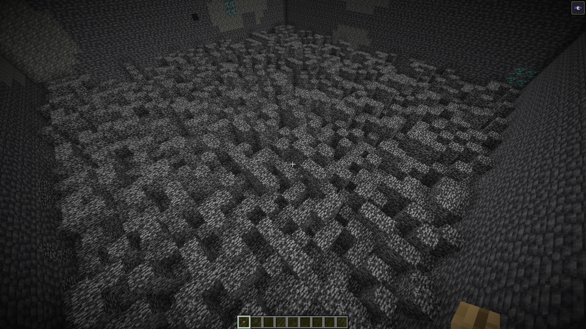
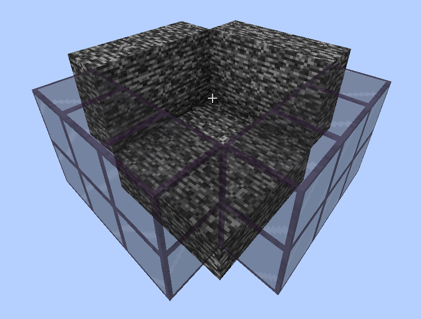
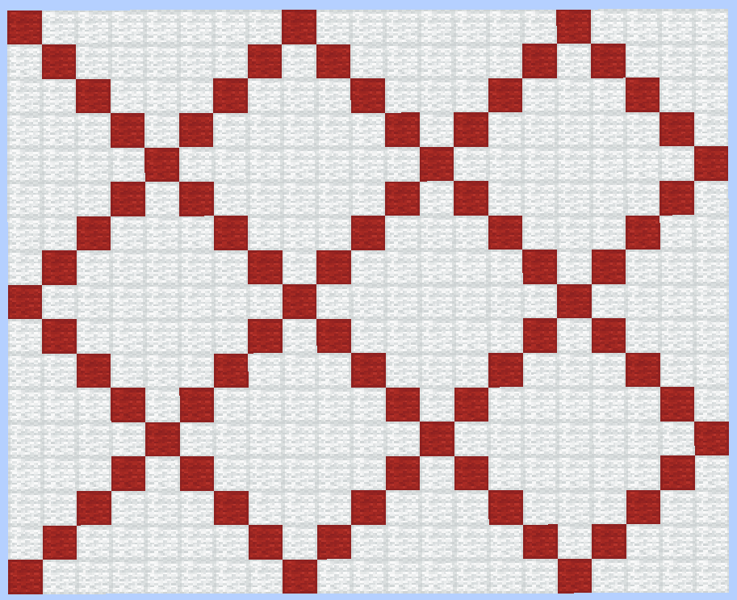
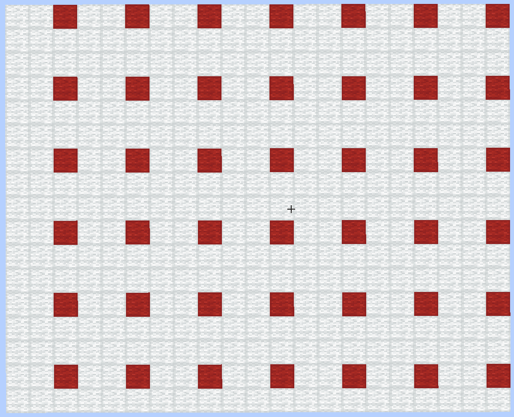

> This post has been sitting in my drafts for a year because I never finished benchmarking stuff to the point I consider thorough enough for release. I'm trying to deal with my backlog, and I think this post has tricks that some of you might enjoy anyway. Treat it as a director's cut sort of thing.

Minecraft generates a bedrock floor at the bottom of the world from a random noise. Since it's random, it can contain naturally generated unescapable regions -- prisons. While small prisons are common, larger ones are hard to find -- a Minecraft world is about $60$ million by $60$ million blocks, so locating these boxes is computationally difficult. So when I saw [Bamboo Bot's video](https://www.youtube.com/watch?v=m85D_RKJWUQ) on this concept covering a simple tool written in Java, I knew I had to give a try myself.


After keeping my PC running for a couple days, here's the largest prison I found:


I find this problem a good exercise for performance optimization because it has a limited scope, but also covers lots of topics. And it's quite a head-scratcher due to its large scale! In this post, I'll cover various surprising approaches and tricks I used, and hopefully you'll be able to apply them to your projects.


### Setting

The bedrock noise is generated by a boolean function $\mathrm{Bedrock}(x, y, z)$. It computes a random float from $0$ to $1$ based on the coordinates and compares it with a probability to determine whether it should place bedrock or keep air. At $y = -64$, the probability of bedrock is $1$, and it decreases as we go up, reaching $0$ at $y = -59$.



The simplest bedrock prison we're searching for looks like this. The player cannot perform a two block high jump under normal conditions, so after they get into this box, they'll never be able to escape it (without damage ticks, anyway).



Large boxes of this exact kind are incredibly rare, so even with optimizations we'll have to look for more complex structures.


### Reducing complexity

While we *could* perform an exact analysis in the 3D space, that would be incredibly difficult to compute performantly. Instead, we can reduce this to a 2D problem that can be handled much more efficiently.

Let's separate $1 \times 1$ columns of blocks into three categories:

- Interior, which is a column where a player can stand on the $y = -64$ block, i.e. a column where both $y = -63$ and $y = -62$ blocks contain air.
- Wall, which is any block configuration a player standing on $y = -64$ cannot jump over. This includes columns where bedrock is present at $y = -62$, or columns where bedrock is present at both $y = -63$ and $y = -61$.
- Hazard, which allows a player to jump from a $y = -64$ block to a higher block, i.e. a column with a block at $y = -63$ and an empty two-block space above.


Any connected component of interior blocks that doesn't border hazards is a prizon. This doesn't cover some trickier valid prisons, but here's my thought process.

Since worlds are gigantic and there are many seeds, we'll never run out of search space. So it doesn't matter if we skip difficult candidates -- there will always be simpler ones elsewhere. The only thing that matters is how many prisons we can locate in a second, and solving the problem *exactly* wouldn't compensate the decreased performance nearly enough.

That is, compared to an exact solution, "incomplete" and "incorrect" checks can produce better results for the same amount of resources spent.

This tradeoff also applies to problems outside brute-force search:

- You don't need to use a perfect or even a quality hash if your hash table can handle collisions fast enough via alternate means.
- You don't need to perform a comparison before applying atomic CAS if unconditional comparison is more expensive than an occasional failed swap.
- You might not need to gate checks with faster checks with false positives if the latter check has a 50/50 trigger rate, because performance will suffer from branch misprediction more than from a heavier check.


### Basic algorithm

Let's start writing some code. We have a 2D grid and want to find a maximum region of "interior" cells surrounded by "wall" cells, bordering no "hazard" cells. This is typically implemented by invoking DFS from each cell:

```rust expansible
// Pseudocode, has borrowck errors -- don't think too much about it.
let mut visited = HashSet::new();
let mut region_size = 0;

let mut dfs = |node: (i32, i32)| -> Result<(), ()> {
    visited.insert(node);

    match get_column_type(node) {
        ColumnType::Interior => {
            // Keep iterating to neighbors.
        }
        ColumnType::Wall => {
            // Can't navigate through walls.
            return Ok(());
        }
        ColumnType::Hazard => {
            // Encountered a hazard -- abort immediately.
            return Err(());
        }
    }

    region_size += 1;

    for (dx, dz) in [(-1, 0), (1, 0), (0, -1), (0, 1)] {
        let node1 = (node.0 + dx, node.1 + dz);
        if !visited.contains(&node1) {
            dfs(node1)?;
        }
    }
    Ok(())
};

for z in -WORLD_BORDER..=WORLD_BORDER {
    for x in -WORLD_BORDER..=WORLD_BORDER {
        if !visited.contains(&(x, z)) {
            region_size = 0;
            if dfs((x, z)).is_ok() {
                // Yay, a new valid region of size `region_size`!
            }
        }
    }
}
```

As the graph is enormous, `visited` will run out of space really quickly, so this doesn't quite work. But we can fix this -- algorithms are not set in stone. By persisting only the last row worth of data, we retain enough context for DFS (the retained cells act as a boundary between dropped cells and remaining cells, so dropped cells are never accessed) while reducing the maximum `visited` size to $\approx 60 000 000$ elements.

```rust
for z in -WORLD_BORDER..=WORLD_BORDER {
    for x in -WORLD_BORDER..=WORLD_BORDER {
        if !visited.contains(&(x, z)) {
            region_size = 0;
            if dfs((x, z)).is_ok() {
                // Yay, a new valid region of size `region_size`!
            }
        }
        visited.remove(&(x, z - 1)); // <- this is new
    }
}
```

Note that I *don't* populate an entire row and then drop the previous row once it's fully complete. Instead, I remove the cell above as soon as I process the current cell. So at any point in time, the present cells are actually split between two neighbor rows. This is known as a *broken profile*, as opposed to just a normal straight profile, and it's occasionally [used to optimize dynamic programming](https://usaco.guide/adv/dp-broken-profile).

Now we can run the code and get the first estimates for how much time this will take:

```
...
[8.294270481s / 0.0000011695244307304885%] found 11 at (12102852, -29999984)
...
```

So it takes about $22$ years to scan the whole world. How we can improve it?


### High-level opts

There's a lot of low-hanging fruit here. For example, we're using the default hashset, even though a bitset indexed by $x$ could work. I wouldn't spend time on that yet, though. While optimizing data structures is useful, it's always better to reduce the need for them first. Let's apply high-level optimizations and then tune low-level details instead of shoehorning them in, just to tear them out later.

A quick check shows that there's a *lot* of prisons, most of them small, so there's no point in saving or even finding all of them. Let's reframe the problem as only finding "large enough" components.

A simple way to benefit from this is by invoking DFS in a checkerboard pattern: by starting search only from every other square, we can find all prisons of size $\ge 2$ while reducing the number of invocations. This approach can be improved further by switching to rhombi (rectangles would work too, albeit $\sqrt2$ times less efficiently):



The radius can be chosen arbitrarily. This combination can only miss components that fit within the $25$-block white region, so we're guaranteed to locate components of size $\ge 26$. This is about as high as these prisons get, according to some quick checks, so I can't increase it to improve performance further. This reduces the number of root `dfs` invocations by $67\%$:

```rust
for coords in diagonals() {
    if !visited.contains(&coords) {
        region_size = 0;
        if dfs(coords).is_ok() {
            // Yay, a new valid region of size `region_size`!
        }
    }
}
```

A computer cannot perform $60000000^2$ operations fast even if they're insanely optimized, but skipping some of them altogether makes this way more realistic.

No code is better than fast code. This is an incredibly broad advice, so I'll give some examples you might get inspiration from:

- When your program has lots of clones and copies, you don't optimize `memcpy`, you use pointers (although there are obviously exceptions, e.g. small objects and cache locality). Optimizing primitives is incredibly useful, but only after you reduce the amount of times they're used.
- [Alpha-beta pruning](https://en.wikipedia.org/wiki/Alpha%E2%80%93beta_pruning) and similar cut-offs are applicable in game theory. More generally, early return is often applied in recursive algorithms when it can be proven that, at the current point, no further recursive calls can result in a better answer than the currently known optimum.
- When iterating over set bits of a number, use bit tricks (e.g. `x &= x - 1;`) instead of checking if each individual bit is set.
- Replace large JSONs with binary serialization formats -- that'll save you integer and string parsing costs. Better yet, use zero-copy approaches like [rkyv](https://rkyv.org/) or [cap'n proto](https://capnproto.org/) -- that'll save you pre-parsing costs as well.
- Instead of checking a precondition on each method call (e.g. to validate UTF-8), make it a type invariant.

Another way to skip small prisons is to probe evenly distributed coordinates:



But this can also miss narrow large components. It *will* find all prisons containing a $3 \times 3$ square, but that's a different problem from the one we started with, and I don't want to pivot that far out.

I like separating pure optimizations from the ones that change the problem. This saves you a headache of worrying about what ifs: what if the PRNG seed was unlucky? What if we haven't found an optimal solution just because of arbitrary choices in the implementation? If you avoid heuristics, you avoid all this trouble.


### `visited`

Unfortunately, we're once again in trouble due to memory usage: the `visited.remove(&(x, z - 1));` trick doesn't work with diagonals.

Another way to fix this issue is to clear `visited` before every DFS invocation. Typically, this would increase the DFS time complexity from $\mathcal{O}(n)$ to $\mathcal{O}(kn)$, where $k$ is the average component size, since we'd be visiting each component multiple times. But we only invoke DFS from every *diagonal* cell, so overhead is lower, and reducing the set size from $\approx 60 000 000$ to the average component size improves cache locality.

```rust
for coords in diagonals() {
    visited.clear();
    region_size = 0;
    if dfs(coords).is_ok() {
        // Yay, a new valid region of size `region_size`!
    }
}
```

Surprisingly, this improves performance $30 \times$, reducing the total time to $250$ days. I think this is due to the reduction in the `HashSet` size -- and now suddenly a bitset doesn't seem like a good solution, as it won't fit in cache as well as `visited` does!

```
[445.198978ms / 0.000001923848745618791%] found 11 at (-29990069, -29998131)
[2.17199706s / 0.000009889538106497513%] found 12 at (-29991087, -29982201)
[2.798458445s / 0.000012758756604408164%] found 11 at (-29997794, 29971862)
[2.798479765s / 0.000012758756731392425%] found 11 at (-29997793, 29971863)
[2.79848252s / 0.000012758756858376685%] found 11 at (-29997792, 29971864)
...
```

It's weird, right? Some optimizations work well individually and lead to pessimizations when combined. Even if you've found all the tricks, you still need to figure out which ones to combine. I've written about this in more detail [earlier](../why-performance-optimization-is-hard-work/).


### Vectorization

Recursive calls are slow, and we currently invoke `dfs` for all rhombi cells, even though only a small percentage will be interior cells. By lifting such a check, we can avoid costly function invocations:

```rust
for coords in diagonals() {
    visited.clear();
    region_size = 0;
    if is_interior(coords) && dfs(coords).is_ok() {
        // Yay, a new valid region of size `region_size`!
    }
}
```

Recall that `get_column_type` might need to check three blocks to see if the column is a hazard or a wall, whereas checking if a column is an interior only needs to compare *two* blocks. Checking for bedrock is slow, so this is a great optimization. But now that `is_interior` is invoked for consecutive cells, we can also easily vectorize the check:

```rust
// coords is now [(i32, i32); 8], not (i32, i32)
for coords in diagonals() {
    // is_interior now returns a bitmask
    for coords_index in BitIter::from(is_interior(coords)) {
        let coords = coords[coords_index];
        visited.clear();
        region_size = 0;
        if dfs(coords).is_ok() {
            // Yay, a new valid region of size `region_size`!
        }
    }
}
```

[BitIter](https://docs.rs/bit-iter/latest/bit_iter/) is used to speed up iteration over set bits, as we only expect a small portion of bits to be `1`s. It uses the classical `x &= x - 1` trick under the hood.

A sequential `is_interior` function could benefit from short circuiting: if one of the blocks is bedrock, we don't need to check the other one. Vectorization makes us abandon short circuiting, but increased throughput counteracts the performance loss.

```
[14.82663952s / 0.00019748246707681585%] found 15 at (-29900419, -29980309)
[14.826951506s / 0.0001974862524776069%] found 15 at (-29900418, -29980310)
[29.012100521s / 0.0003862456819715604%] found 16 at (-29997419, -29835789)
[38.530737716s / 0.000512744426557512%] found 17 at (-29899478, -29908354)
[38.53121425s / 0.0005127505261194575%] found 17 at (-29899477, -29908355)
...
```

This is great news: the vectorized implementation now takes $86$ days to scan the world, a $3 \times$ improvement. And that's with the slow built-in `HashSet`!


### Floats

Let's discuss the vectorized implementation in more detail. To do that, we need to take a look at the formulas used for bedrock generation first.

:::aside
I'll write `lerp(x, a, b)` to map $x = 0$ to $a$, $x = 1$ to $b$, and linearly interpolate values for other $x$s. `lerp_inv` is its inverse.
:::

Video games are notorious for using floats all over the place. Minecraft's bedrock noise is no exception. Minecraft generates bedrock at $(x, y, z)$ with probability $p$ increasing with $y$, interpolated linearly from $p = 1$ at $y = -64$ (the bottom layer) to $p = 0$ at $y = -59$ (one above the top layer):

<aside-inline-here />

```rust
fn is_bedrock(x: i32, y: i32, z: i32) -> bool {
    let mut prng = Prng::new(hash_coordinates(x, y, z));
    let probability = lerp(lerp_inv(y as f32, -64.0, -59.0), 1.0, 0.0);
    f64::from(prng.next_f32()) < probability
}
```

While floats are often good enough, they are a nuisance here due to imprecision. Luckily, when checking the type of a column `(x, z)`, `y` is a constant, so `probability` can be precomputed, and we only need to deal with `prng.next_f32()` and the cast to `f64`.

`next_f32` is implemented by generating $24$ random bits and dividing them by $2^{24}$. Such a division is exact, and casting `f32` to `f64` is always exact as well, so the last line of `is_bedrock` is equivalent to:

```rust
prng.next_bits(24) as f64 < probability * 2f64.powi(24)
```

...which can in turn be rewritten as:

```rust
prng.next_bits(24) < (probability * 2f64.powi(24)).ceil() as u64
```

...where the right-hand side is a constant, so we can avoid all runtime float operations.

Note the use of `.ceil()` and excessive focus on which floating-point operations are exact. This ensures that the simulation doesn't use slightly incorrect data, which is certain to cause problems over the span of $60 000 000^2$ blocks.

A shameless plug: while we could optimize out the `as f64` cast here, that's not always possible, so you might be interested in my snippets for [faster int $\leftrightarrow$ float conversion](../fast-limited-range-conversion-between-ints-and-floats/).


### AVX-512

`hash_coordinates` and `prng.next_bits` are not very interesting -- it's just an ad-hoc hash and Xoroshiro:

```rust expansible
fn hash_coordinates(x: i32, y: i32, z: i32) -> u64 {
    let mut l = (x.wrapping_mul(3129871) as i64) ^ (y as i64) ^ ((z as i64) * 116129781);
    l = l.wrapping_mul(l.wrapping_mul(42317861).wrapping_add(11));
    (l >> 16) as u64
}

impl Prng {
    fn new(seed: u64) -> Self {
        Self {
            low: seed ^ FLOOR_SEED_LOW,
            high: FLOOR_SEED_HIGH,
        }
    }

    fn next(&mut self) -> u64 {
        let Self { low, mut high } = *self;
        let mid = low.wrapping_add(high).rotate_left(17).wrapping_add(low);
        high ^= low;
        self.low = low.rotate_left(49) ^ high ^ (high << 21);
        self.high = high.rotate_left(28);
        mid
    }

    fn next_bits(&mut self, bits: usize) -> u64 {
        self.next() >> (64 - bits)
    }
}
```

They're both nasty because of $64$-bit integer multiplication, which is notoriously hard to vectorize, because most vector ISAs simply don't support it. I've recently got my hands on a Zen 4 node, though, and the capabilities of AVX-512 blew my mind. AVX512DQ introduces $64$-bit multiplication, and while the performance improvement is far from the theoretical $8 \times$, it still helps out a ton.

AVX-512's orthogonality significantly simplifies both algorithm design and code: this whole project has no `unsafe` and relies exclusively on [portable SIMD](https://doc.rust-lang.org/std/simd/index.html), and the codegen is nearly optimal, unlike in many other situations when I've tried this.

Obviously, AVX-512 is highly non-portable, so that's still not an option in many cases, but it's more than fine for this project: it's not like such brute-force even has a chance to work well on old hardware.

That's vectorization done. What else comes to your mind?


### Coarse filtering

Many algorithms include fast paths for special cases -- like `memcpy` for small `n`. This is typically done if you can quickly check whether the fast path is applicable before applying it. But if the performance benefit is high enough, you can actually use this approach even if the correctness of the fast path result is only known post factum.

Here's what I mean. We currently spend time checking columns for hazards, even if the component turns out to be too small. Let's split the DFS run into two: first we compute the size of the interior equating hazards to walls, and then, if it's large enough, we check for hazards. This removes a short-circuit check, but since most components are eliminated faster, in the end this boosts performance.

```rust
let mut fast_path_dfs = |node: (i32, i32)| {
    region_size += 1;
    for (dx, dz) in [(-1, 0), (1, 0), (0, -1), (0, 1)] {
        let node1 = (node.0 + dx, node.1 + dz);
        if visited.insert(node1) && is_interior(node1) {
            dfs(node1);
        }
    }
};

let mut slow_path_dfs = /* old dfs implementation */;

// ...

if fast_path_dfs((x, z)) && region_size >= CUTOFF && slow_path_dfs((x, z)).is_ok() {
    // Yay, a new valid region of size `region_size`!
}
```

A lower-level example of this optimization is DFS itself. Tracking visited nodes in a `HashSet` is slow even with a custom hash, but as most components are small, we can use a bitset which just enough bits for cells close to the starting point. If we stay inbounds, we get good cache locality. If we occasionally get out of bounds, we restart DFS with a `HashSet`.

```rust
fn insert(set: &mut [u32; 32], (x, z): (i32, i32)) -> bool {
    let row = &mut set[z as usize & 31];
    let bit = x as usize & 31;
    let is_new = (*row >> bit) & 1 == 0;
    *row |= 1 << bit;
    is_new
}
```

The $x$ and $z$ values here are the actual coordinates, not offsets from the start -- masking bits is cheaper than subtraction, and for shifts it's free. The fact that a row takes $32$ *bits* as opposed to $32$ *bytes* also means that the address of `row` can be computed as `set + (z & 31) * 4`, which is an addressing mode x86 supports directly.

In fact, we can avoid the per-cell overflow check entirely. Due to masking, memory accesses never cause UB, so the worst thing that can happen is skipping some cells on wrap-around. If DFS computes the component size as $\ge 32$, there might have been some aliasing, so we restart with a `HashSet`. Otherwise, we can trust the count.

Alternatively, we can guarantee no wrap-around if there's an empty row and a column. This check fails more rarely, but is more expensive, so it's not the best choice.

Such a bitset with occasional false positives is tangentially related to [Bloom filters](https://en.wikipedia.org/wiki/Bloom_filter). Just putting this here for completeness -- look it up if you haven't heard of it before.


### DFS

The only thing left to optimize is the DFS itself, and I left it for last because it's a broad topic. The first step is to rewrite DFS to be iterative (BFS-style) rather than recursive:

```rust
// Initialization:
let mut stack = Vec::new();

// Main loop:
visited.clear();
visited.insert(coords);
region_size = 0;
stack.clear();

stack.push(coords);
while let Some(coords) = stack.pop() {
    if !is_interior(coords) {
        // Can't navigate through walls.
        continue;
    }

    region_size += 1;

    for (dx, dz) in [(-1, 0), (1, 0), (0, -1), (0, 1)] {
        let coords1 = (coords.0 + dx, coords.1 + dz);
        if visited.insert(&coords1) {
            stack.push(coords1);
        }
    }
}
```

But be careful: in my experience, iterative DFS is often slower than recursive DFS. This seems to be a common experience in the competitive programming community for reasons I don't really understand. Here's some of my hypotheses:

- Recursive DFS keeps track of nodes on the path from root to the current vertex, whereas iterative DFS also stores the direct children of such nodes on the stack.
- If the DFS has early returns (like ours had with hazards), recursive DFS triggers them early, whereas iterative DFS has already pushed quite a few more nodes.
- Allocating the stack on the heap might be slower than using an existing stack.

In this case, though, iterative DFS enables another optimization. We don't necessarily need depth-first order, and, surprisingly, this enables vectorization! Instead of popping one cell on each iteration, we can pop $8$ cells, invoke vectorized `is_interior` just once, and then only handle the rare filtered interior cells sequentially:

```rust
// Pseudocode, obviously
while !stack.is_empty() {
    let coords = stack.pop_at_most_eight();

    for coords_index in BitIter::from(is_interior(coords)) {
        let coords = coords[coords_index];
        region_size += 1;

        for (dx, dz) in [(-1, 0), (1, 0), (0, -1), (0, 1)] {
            let coords1 = (coords.0 + dx, coords.1 + dz);
            if visited.insert(&coords1) {
                stack.push(coords1);
            }
        }
    }
}
```

For narrow graphs, we could often have to handle fewer than $8$ nodes at once, but since we're on a grid, this is not an issue.

Finally, we can apply unrolling. The first iteration always pops the interior cell on the diagonal and pushes its four neighbors, and the second iteration immediately pops them, so let's just start DFS from that point:

```rust
// Pretend this array concatenation compiles.
let mut coords = [(-1, 0), (1, 0), (0, -1), (0, 1)].map(|(dx, dz)| (coords.0 + dx, coords.1 + dz))
    + [(i32::MAX, i32::MAX); 4];

region_size = 1;
stack.clear();

loop {
    for coords_index in BitIter::from(is_interior(coords)) {
        let coords = coords[coords_index];
        region_size += 1;

        for (dx, dz) in [(-1, 0), (1, 0), (0, -1), (0, 1)] {
            let coords1 = (coords.0 + dx, coords.1 + dz);
            if visited.insert(&coords1) {
                stack.push(coords1);
            }
        }
    }

    if stack.is_empty() {
        break;
    }
    coords = stack.pop_at_most_eight();
}
```

In the common case, when the interior cell is surrounded on all sides, this lets us avoid touching stack, which removes the delay from failed store-to-load forwarding.


### Stack layout

Now that high-level algorithms are fixed, we can optimize minor details, such as the `stack` data structure. Since `is_interior` wants X and Z coordinates in two separate vectors, we'll actually need two stacks, one for X and one for Z.

Since vectors have a fixed size (`i32x8`, in this case), `pop_at_most_eight` needs to somehow handle the case when there are fewer than $8$ elements in the stack. By adding $7$ sentinel elements before the actual stack elements, we ensure that reading `i32x8` always works correctly:

```rust
// Storage (reused between iterations):
let mut x_stack = [SENTINEL; 7 + 32 * 32];
let mut z_stack = [SENTINEL; 7 + 32 * 32];

// To pop 8 elements:
let x = i32x8::from_slice(&x_stack[7 + stack_size - 8..7 + stack_size]);
let z = i32x8::from_slice(&z_stack[7 + stack_size - 8..7 + stack_size]);
stack_size = stack_size.saturating_sub(8);
```

Once initialized, sentinels are never overwritten, as the stack size saturates at $0$.

`(i32::MIN, i32::MIN)`, which is outside the world border and thus non-interior, works as a sentinel that we don't need to special-case. If there wasn't such a natural sentinel, we could still search for some non-interior cell greedily and then use its coordinates.


### Conclusion

And that about sums it up. I could add parallelization, but it's much easier to just run the single-threaded program on different seeds in parallel.

The code incorporating most of these optimizations can be found [on my GitHub](https://github.com/purplesyringa/bedrock-prison-searcher). The final project searches through the whole world in about a month in single-threaded mode. That's about $1.5 \cdot 10^9$ cell area covered in a second (not all of those cells are actually computed, as we only probe diagonals).

To put this into perspective, that's roughly the speed of summing up integers with scalar code. Here's the list of tricks we've used to optimize a non-trivial analysis of a procedurally generated map this much:

- We simplified the problem to a well-known one (component labeling on a grid), formalizing the goal and making it approachable in the first place.
- Skipped unnecessary work by utilizing the pattern of the particular variation of the problem at hand (checking diagonals only).
- Vectorized independent calculations (diagonals) and calculations that could be made independent with modifications (DFS).
- Lowered complexity by reducing float arithmetic to integers.
- Tuned data structures to map onto machine capabilities (`visited` as `[u32; 32]`).
- Kicked general-purpose implementations as far down the road as possible out of the hot path (unrolled first iterations and removed some memory accesses from DFS, moved hazard checks out of the main DFS loop).
- Applied approach-agnostic optimizations (multi-threading and using multiple computers) at a late point where it doesn't affect logic-heavy code.

This bullet list can act as a checklist for your projects: see if you've utilized all of these approaches, and if you can't instantly name examples from your own experience where you've applied these tricks, focus on improving your skills by focusing on that topic.
