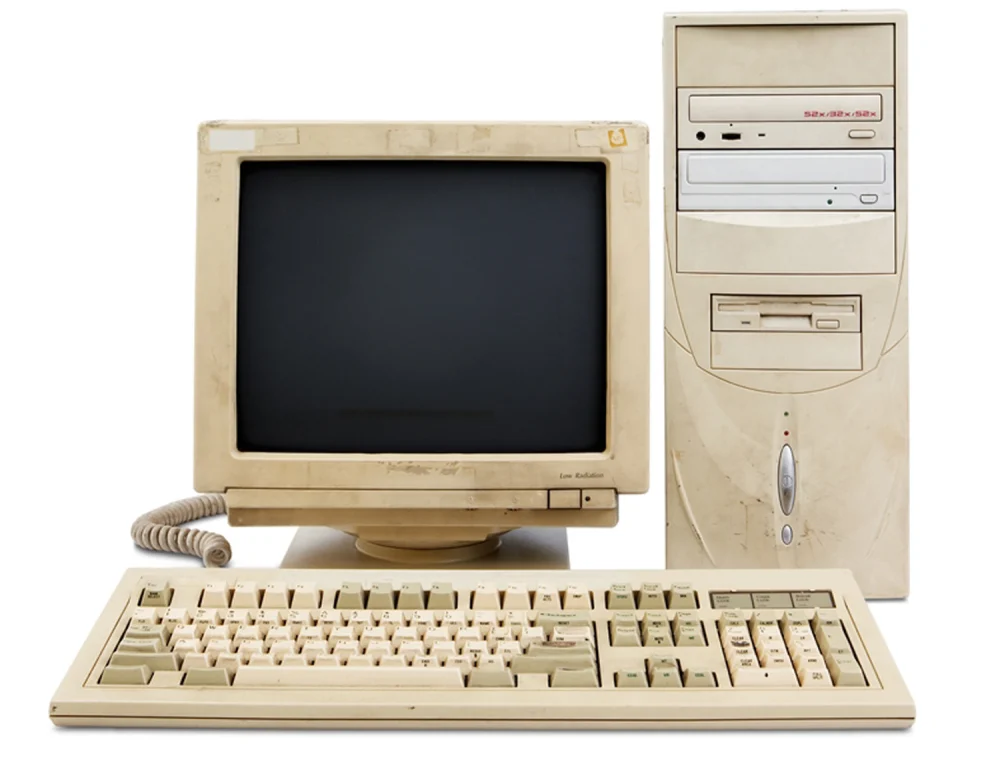
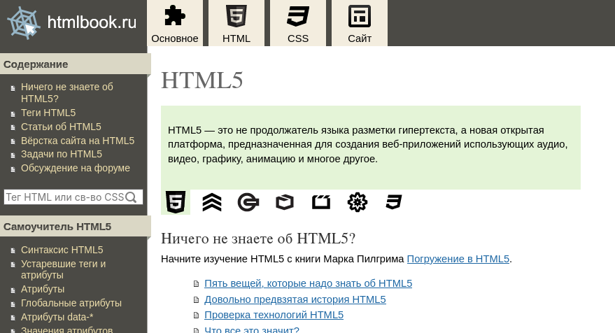

The appearance of [Mythos](https://www.anthropic.com/glasswing) -- a private LLM allegedly capable of finding a multitude of [0-days](https://en.wikipedia.org/wiki/Zero-day_vulnerability) -- has made people [concerned about being denied powerful tools](https://tanyaverma.sh/2026/04/10/closing-of-the-frontier.html). This seems to be a turning point in the mainstream discourse, and it motivated me to complete the think piece I've been meaning to write for a while.

I have a related, intimate worry regarding LLMs. Just so that we're clear, it's not a common critique from the anti-AI crowd, like ethics or quality. While I share some reservations, frankly it's not what gives me the most angst. My intent is to make this post thought-provoking even if your beliefs on this topic entirely differ from mine.

### Backstory

I'm going to start a little personal.

I started programming as a child in the beginning of 2010s, thanks to my dad. He didn't work as a software developer, so he insisted on using the technology he used and understood: QBasic. It's an MS-DOS IDE for BASIC back from 35 years ago, and it was what you'd expect from such old software: a slow interpreter, 80x25 text mode output, 16 (!) colors in graphical mode, and a white-on-blue-background editor.

I didn't run it on a Windows 7 laptop via [NTVDM](https://en.wikipedia.org/wiki/Virtual_DOS_machine) or [DOSBox](https://www.dosbox.com/) -- common emulators of that time. No, it was an actual epoch-appropriate PC. I don't have photos of my own, but here's a stock picture just to get the feel across:

I didn't know English much at the time, and there wasn't built-in documentation regardless, so I had to learn by trial and error. `Redo from start` still haunts me.

I'm not telling you this to brag or beg for sympathy -- I'm giving context for why I feel comfortable talking about the history of computing despite my young age and naivety. Even though I didn't live through it, I heard tales, and I often find myself researching retrocomputing despite having modernized my stack.

### Education

When I finally got access to a Windows PC, I started learning PHP after finding a self-teach book by accident. I found php.net pretty soon and switched to online documentation. I learned to work with the filesystem, set up Apache, played around with `C:\Windows\System32\Drivers\etc\hosts`. It snowballed from there.

You could learn a lot of stuff with barely any resources. I needed Internet access, sure, but I used an outdated Windows XP machine with (I believe) Pentium II just fine. Later, I learned C++ syntax from [the PVS-Studio blog](https://pvs-studio.com/en/blog/examples/) and a multitude of online tutorials.

The number of places offering free knowledge cannot be overstated. htmlbook.ru and [javascript.ru](https://javascript.ru/overview) helped me learn webdev, to name a few. And don't forget Khan Academy!

Although I switched to a somewhat more powerful laptop by that point, I used it beyond its intended lifetime until it couldn't keep up with Windows. I was able to use browsers, IDEs, and other free tools during all that time thanks to optimization. The only program that wasn't responsive was VS Code, but it was easy to replace.

I immensely appreciate having access to this much information and tools. It was the work of countless people, doing their best to provide high-quality compilers and tutorials for free that allowed me to eventually become a person people look up to.

### The mainframe age

It hasn't always been that way.

<aside-start-here />

There was a time when there was no GCC, no Linux, and no VS Code. There were proprietary, expensive compilers and systems provided by a few major vendors. It's difficult to find the exact prices, but around 1990, [Watcom C/C++](https://en.wikipedia.org/wiki/Watcom_C/C%2B%2B) (used by DOOM among other projects) [cost $1000](https://www.os2museum.com/wp/watcom-win386/), and the source for AT&T UNIX [cost $10'000](https://www.linux.co.cr/free-unix-os/review/1992/0721.html). The $1000 cost of BSD/386 was considered incredibly cheap.

:::aside
Multiply by 2.5 to account for inflation.
:::

While this got the developers of core infrastructure paid, it meant that only large technical companies and universities could afford state-of-the-art software -- hobbyists were left on their own. With the proliferation of personal computers in 1980s, like Amiga, ZX Spectrum, and Commodore 64 (kilobytes, not bits), people were able to develop their own programs (usually games), but only in BASIC and assembly, which was either limiting or required subtle, non-widespread knowledge.

<aside-start-here />

:::aside
Picture: [Defender of the Crown](https://en.wikipedia.org/wiki/Defender_of_the_Crown), a strategy game for Amiga.
:::

Even though it was common for people to share hobbyist and pirated proprietary software via [sneakernet](https://en.wikipedia.org/wiki/Sneakernet) or at [LAN parties](https://en.wikipedia.org/wiki/LAN_party), the culture didn't see people *collaborating* on large open-source software systems until later. Perhaps it was because people cosplayed corporations, adding amusing freeware licenses and implementing copy protection for fun; or perhaps everyone tried to make a living out of it.

The Free Software movement was the driving force behind turning the tide. Providing a free -- both as in freedom and as in free beer -- C compiler, IDE, and OS kernel and userspace acted as a catalyst, paving the way for open-source software to shape the world we live in today.

### Hidden cost

I'm deeply grateful to the FOSS community and the people around it for enabling unfettered access to information and software, because that's what allowed me to get into this profession in the first place.

It wasn't thanks to programs or services with free trials -- I needed to be able to keep learning after a month has passed.

It wasn't thanks to student plans -- I was a child without agency who couldn't submit any confirmational documentation or pay out of pocket.

It wasn't thanks to free plans -- I was already limited by status and knowledge gaps, and further restrictions would only exacerbate the issue.

I hacked together GitHub Pages, GitLab CI/CD, and Heroku to implement server-side logic. I used decentralized networks. The difference between $0 and $1 wasn't "free" vs "cheap". In my circumstances, it was "possible" vs "unachievable".

### LLMs

Which brings me to LLMs.

When running locally, their performance directly scales with computing power. Running GCC on a low-end device might take five minutes instead of two, but LLMs become straight up unusable if you don't have a GPU or enough RAM. Even the simplest coding agent requires more hardware than an average person has.

With closed-weight LLMs, you have to play around with different models and companies, paying for each one in the meantime (the opinion on which one's the best changes every month). The simplest solution is to make it your employer's problem: previously adequate cheap models are lobotomized and free usage is highly limited.

It's not a shock to anyone: LLMs are expensive to run and maintain. It still sucks.

I don't know if juggling LLMs should be a central task of software development. I&nbsp;doubt anyone truly knows. But the industry is changing, and LLM-enabled programming will likely remain a major part of it in some shape or form.

And whatever LLM-first workflows will look like, they won't be nearly as accessible as the approaches of yesteryear. Those functioned well not only for companies and compsci students, but also for those who couldn't submit documentation for an educational plan, developers in underdeveloped countries, and tiny teams.

A middle schooler can learn Python on a family iPad. They can't learn vibecoding.

### Conclusion

And so it bothers me that this might regress computing back to the plutocracy of 1970s. It's easy to think of that time as the golden age of computing from folklore if you didn't live through it, but it was also expensive, undemocratic, and limiting.

Economical instability, FOMO combined with costly subscriptions, fast pacing, and vendor lock-in can make new practices intractable outside of institutions, like firms and universities. You might afford it -- what about those who can't?

I know some of you can relate to making do with limited resources, software, or hardware. So far, the lessons we learned along that way have been useful despite that. But they can easily become worthless in LLM-centric programming. And it saddens me that I have to wonder if no one else will be able to walk the road I did.
