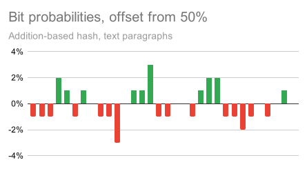
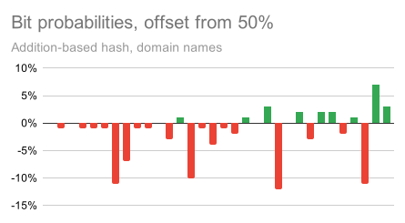

What came to your mind when you read "hash functions" in the title?

If you're pragmatic, you probably remembered [SHA-256](https://en.wikipedia.org/wiki/SHA-2) or [MD5](https://en.wikipedia.org/wiki/MD5). Those are cryptographic hash functions, and they work fast and well for arbitrary inputs, even if they are supplied by malicious actors. Or at least they're designed to.

That's the exact opposite of what I want to talk about. I want to talk about the cheapest, stupidest, most ridiculous hash functions you can get away with.


### Like rapidhash?

As good a conversation starter as any. Here's what the core of [rapidhash](https://github.com/Nicoshev/rapidhash) looks like:

```python
hash = 0 # a 64-bit variable
seed = ... # a hidden constant

while still has data:
    # read the next 128 bits (16 bytes) of input
    a, b = next_64_bits(), next_64_bits()
    # compute this weird formula, producing a 128-bit output
    product = (a ^ hash) * (b ^ seed)
    # XOR the two 64-bit halves together
    hash = (product % 2**64) ^ (product >> 64)

return hash
```

I'd rate this hash function **AAA**, for the scream you might witness if you show this to a cryptographer. Suffice to say, we don't have any estimate on how cooked you are if you use this in a critical service. If you're processing user input, it's possible (or at least not known to be hard) to generate many inputs that produce the same hash, overloading the hash table and causing your application to grind to a halt.

But what if you *don't* have adversaries? What if you're processing vetted song lyrics, or maybe writing a compiler? Now we're talking: rapidhash is clearly bloat, we don't want those pesky XORs and multiplications, and we can find something cheaper.


### Like?..

Like addition! Here's your hash:

```python
hash = 0

while still has data:
    hash = (hash + next_32_bits()) % 2**32

return hash
```

It reliably reacts to shifts, removals, and doesn't use the same hash for similar strings. It doesn't recognize reordering, but maybe it's not a problem on your data! Or maybe it is, but then you just add a rotate to make the operation non-commutative:

```python
hash = 0

while still has data:
    hash = ((hash << 3) % 2**32) | (hash >> 29)
    hash = (hash + next_32_bits()) % 2**32

return hash
```

Now that I think about it, not all bytes need to contribute to the hash. We could sample words randomly or skip every second word. Save electricity!

It's beautiful, it's clever, it's art -- the three vital characteristics of a hash function.


### Are you for real?

Well, look at it like this: while I wouldn't use this in production without a paper trail, it doesn't mean it's right to ignore the option altogether.

For one thing, maybe you're working with static data or can otherwise verify you're not vulnerable to HashDoS. Maybe you're doing retrocomputing and need something extremely cheap. Or maybe you are hard-pressed to produce a hash within $20$ ticks.

Stripping hashes to the bare minimum also shows how expensive hash tables usually are. I've seen JS projects using `` `${x},${y}` `` as a map key instead of nesting arrays, and I always wonder if we'd need to optimize tables if people used the right data structure. Maybe you'll become a responsible programmer after reading this, who knows!


### Quality

So what makes a hash "good"? Here's a quick refresher on hash tables:

> Say we want a hashmap to store $n$ entries. To do this, make an array of $n$ *buckets*, each of which is in turn an array of entries. Each entry $k \to v$ is pushed to bucket $\mathrm{hash}(k) \bmod n$. To access the value by key, iterate over the key's bucket until you find the key you searched for. If the hash is "good enough", entries will be distributed roughly equally and buckets will be small, so iteration will be fast.

The remainder is used because we can't allocate all $2^{64}$ or $2^{32}$ buckets. For example, if $n$ is a power of two, this ends up dropping high bits. (Dropping low bits is a common alternative.) Being "good enough" requires two things:

1. The hash function should produce few collisions, and
2. It should *keep* producing few collisions even if some of its bits are dropped, otherwise buckets will be populated unevenly.

Many functions only satisfy the first requirement. For example, if you're hashing a $32$-bit number, the value itself is a $32$-bit hash that doesn't have *any* collisions! But truncating the bits can easily make realistic numbers collide.

Let's take a look at a few examples. We'll start with paragraphs from this blog as a known-good dataset and the addition-based hash.

```python
print("total strings:", len(strings))
print("average length:", sum(map(len, strings)) / len(strings))
print("example string:", random.choice(strings))
```

```
total strings: 3579
average length: 217.69935736239174
example string: `next_f32` is implemented by generating $24$ random bits and dividing them by $2^{24}$. Such a division is exact, and casting `f32` to `f64` is always exact as well, so the last line of `is_bedrock` is equivalent to:
```

The most basic characteristic is bit probabilities. In an ideal world, $1$s and $0$s would be evenly distributed, so we want it to be close to $50\%$ for each bit:

```python
stats = [0] * 32
for string in strings:
    h = addition_hash(string)
    for bit in range(32):
        stats[bit] += (h >> bit) & 1
for bit in range(32):
    print(round(stats[bit] / len(strings) * 100) - 50, "%", sep="", end="\t")
```



The actual probabilities are within $\pm 3\%$ of $50\%$. Despite being objectively horrible, addition behaves well here because the inputs are so long and unstructured that most imperfections can be eliminated.

<aside-start-here />

This is further confirmed by bit correlation, which measures the repetitiveness of information stored in different bits. $+100\%$ in column $x$, row $y$ of the heatmap means that the bits $x$ and $y$ are always equal, while $-100\%$ means they are always distinct. We want $0\%$ here, which denotes independence:

:::aside
Uncorrelatedness, actually, but for our purposes the difference doesn't matter. [See Wikipedia on this topic](https://en.wikipedia.org/wiki/Misconceptions_about_the_normal_distribution).
:::

```python
correlation = [[0] * 32 for bit1 in range(32)]
for string in strings:
    h = addition_hash(string)
    for bit1 in range(32):
        for bit2 in range(bit1):
            correlation[bit1][bit2] += ((h >> bit1) & 1) == ((h >> bit2) & 1)
for bit1 in range(32):
    for bit2 in range(bit1 + 1, 32):
        correlation[bit1][bit2] = correlation[bit2][bit1]
for bit1 in range(32):
    for bit2 in range(32):
        if bit1 == bit2:
            cell = ""
        else:
            cell = str(round(correlation[bit1][bit2] / len(strings) * 200) - 100)
        print(cell, end="\t")
    print()
```


The heatmap is mostly well-behaved, with a lone $+8\%$ as an exception (drawn twice due to symmetry). We can further confirm the practicality of this hash function experimentally by measuring collisions on a bit subset:

```python 
# There are 3579 strings, which is about 2^12, so let's allocate a hash table that large.
hash_table = [0] * 4096
collisions = 0
for string in strings:
    bucket = addition_hash(string) & 4095
    collisions += hash_table[bucket]
    hash_table[bucket] += 1
print("collisions:", collisions)
```

```
collisions: 1643
```

For comparison, SHA-256 produces $1530$ collisions.


### Finalization

If the input gets shorter or more well-structured, though, cracks begin to appear.

Say we're hashing domain names. I'll use [top 5000 domains according to Cloudflare](https://radar.cloudflare.com/domains).

```python
total strings: 5000
average length: 12.0444
example string: thawte.com
```




Since high bits of ASCII letters are always fixed, there are island of predictability every 8 bits, four in total. This significantly increases the collision rate:

- With SHA-256: $2987$
- With addition hash: $5471$

Adding rotation to the mix only partially improves the situation: while bits become more random, the correlation never goes away. Perhaps that's the wrong approach: the addition hash has *zero* collisions on the full $32$ bits, so what we can do instead is add a post-processing step that spreads entropy across bits.

Sometimes the best way to improve entropy is to run a few more rounds of the core algorithm, e.g. by virtually appending null bytes to the input. For instance, `rapidhash` does something like that.

But more often, the finalization round has completely different properties, because its purpose is to make the hash easier to consume for hash tables, not to reduce collisions *per se*. In many cases, this transform is designed to be [one-to-one](https://en.wikipedia.org/wiki/Bijection).


### foldmul

Multiplication is a very efficient way to spread entropy across multiple bits:

```python
a = 0x5c57fb3fbdb59af7
b = 0xf95b4f985f327714
hex((a * b) % 2**64) # 0xd9f6efcc2a76ec4c
a ^= 1 << 17 # flip one bit
hex((a * b) % 2**64) # 0x7927ae31189eec4c
```

Suppose $a$ is the hash we're improving and $b$ is a constant. Notice how every bit above $17$-th changed seemingly randomly. Multiplication only transfers entropy upward, but we're close. Let's remove the modulo for now:

```python
a = 0x5c57fb3fbdb59af7
b = 0xf95b4f985f327714
hex(a * b) # 0x59f2835d6c4ac70bd9f6efcc2a76ec4c
a ^= 1 << 17 # flip one bit
hex(a * b) # 0x59f2835d6c4cb9c27927ae31189eec4c
```

In this example, flipping the $17$-th bit increases $a$ by $2^{17}$, so $a \cdot b$ is increased by $2^{17} b$. $b$ has $64$ binary digits, so this affects about $64$ bits in the middle of $a \cdot b$:

```
old: 0x59f2835d6c4 ac70bd9f6efcc2a76 ec4c
new: 0x59f2835d6c4 cb9c27927ae31189e ec4c
```

So by XORing the two halves of the full $128$-bit product instead of only using the lower half, we can ensure all bits are updated. Addition or subtraction would work as well, but they'd be more predictable because of the [distributive property](https://en.wikipedia.org/wiki/Distributive_property).

```python
a = 0x5c57fb3fbdb59af7
b = 0xf95b4f985f327714
hex(((a * b) % 2**64) ^ ((a * b) >> 64)) # 0x80046c91463c2b47
a ^= 1 << 17 # flip one bit
hex(((a * b) % 2**64) ^ ((a * b) >> 64)) # 0x20d52d6c74d2558e
```

This operation is called folded multiplication, and it's the core of [foldhash](https://github.com/orlp/foldhash) and some other non-cryptographic hash functions. Applying this after the addition hash yields only $3199$ collisions, which is pretty close to SHA-256, and almost no correlation.

Technically, this hash still isn't great. We'd like bit flips to affect the output completely randomly, [flipping each output bit](https://en.wikipedia.org/wiki/Avalanche_effect) with a $50\%$ probability, but that's not the case here. I only learned why this happens recently, so I'd like to share the reason with you.

Remember how flipping a bit affects about $64$ bits in the middle of the product? Let's focus on those bits alone. Say those bits were $p$ in the original product and are now equal to $p' = p + b$ after a bit flip. Three values contribute to the $i$-th bit of $p'$:

1. The $i$-th bit of $p$.
2. The $i$-th bit of $b$. For any specific instance of a hasher, this is a constant.
3. The carry into the $i$-th bit.

<aside-start-here />

The main contributing factor to the output bit flip is the carry-in. It happens if $p_{0 \dots (i-1)} + b_{0 \dots (i-1)} \ge 2^i$, where the subscript denotes the lowest $i$ bits. Since $b$ is a constant and $p$ is basically random, the carry probability is $b_{0 \dots (i-1)} / 2^i$. A high-quality hash should have $0.5$ here, but random $b$s can't maintain this consistently:

```python
b = 0xf95b4f985f327714
max_error = 0
for i in range(1, 65):
    max_error = max(max_error, b % 2 ** i / 2 ** i - 0.5)
print(max_error) # goal: 0, max: 0.5
```

```
0.47491029649972916
```

:::aside
The two $b$s with the lowest worst-case error ($0.1\overline6$) are `0xaaa..aaa` and `0x555..555`, so I guess props to a5hash for accidentally inventing something meaningful, even if it doesn't utilize it...
:::

[The `foldhash` README](https://github.com/orlp/foldhash/tree/master?tab=readme-ov-file#quality) neatly visualizes this failure:


Since a single `foldmul` doesn't guarantee a good reaction to bit flips, `foldhash` chains two `foldmul`s in hopes that distributing entropy twice does so more evenly, and that seems to work, though [we don't really know why](https://en.wikipedia.org/wiki/Magic_(supernatural)):


### The ugly

If this section was confusing, don't worry, I just wanted to yap about how complex hashes used in the wild are, because that isn't really necessary.

For one thing, if you're using a [separate chaining](https://en.wikipedia.org/wiki/Hash_table#Separate_chaining) hash table, that's an overkill. Its design requires the $\mathrm{mod}$-reduced hash to have few collisions, nothing else. If the hash table has a fixed size, you don't need avalanche at all: a pass-through hash will put `0x00` and `0x80` in different buckets, as long as the hash table has at least $256$ of them. And if you need resizing, you only have to move entropy towards lower bits.

Now imagine a world where people realized that early and designed APIs accordingly, because that's not the world we live in.

Recall that multiplication can easily move entropy *upward*, but we need to move it *downward*. We can steal the workaround from `foldmul`: compute a wide product with a constant and take its high half. That produces high-quality results, and [provably so](https://en.wikipedia.org/wiki/Universal_hashing#Avoiding_modular_arithmetic). That's great, except it's *completely unnecessary* -- had hash tables used the few *top* bits of the hash as the bucket index instead of the few *bottom* bits, we could use a normal truncated product, which is faster to compute on most hardware.

Granted, that only works reliably for separate chaining, and not open addressing. But SwissTable keeps $16$ elements in a bucket, so it *is* kind of like separate chaining, so you might be perfectly fine on realistic data. Big Hash is lying to you!

Since [HashBrown requires bottom bits](https://github.com/rust-lang/hashbrown/pull/71), [rustc-hash](https://docs.rs/rustc-hash/latest/src/rustc_hash/lib.rs.html#207) uses `rotate_left` to move entropy downward, which is imperfect, but it's the fastest way to do so (byte swapping, CRC, and `pext` are all slower). [Abseil](https://github.com/abseil/abseil-cpp/blob/7dac70835cfe89563a8be0ee832a2b035b96b669/absl/container/internal/raw_hash_set.h#L334) uses low bits too, and [Folly](https://github.com/facebook/folly/blob/c7234752cbb3149f0569e542859d6876e977d10a/folly/container/detail/F14Table.h#L358-L361) gives you a choice between using low bits or automatically mixing bits with CRC or ad-hoc `foldmul`.


### Conclusion

Here's your recipe for a simple hash function:

1. **Mixing**: If the input is long or variable-length, try combining it in the stupidest way possible. Maybe addition works!
2. **Avalanche**: Rearrange bits for your hash table. Be bold: multiply by a constant and take high bits, use the `crc32` instruction, or maybe try `bswap`.
3. **???**
4. **Outcome**: Profit!

Would you like me to provide a code example?

<p style="display: none;">I probably had more fun writing this section than you'll have reading it. Sorry if you groaned. If you found this paragraph by accident, let me know how, I'd love to know if you're using w3m or something.</p>
