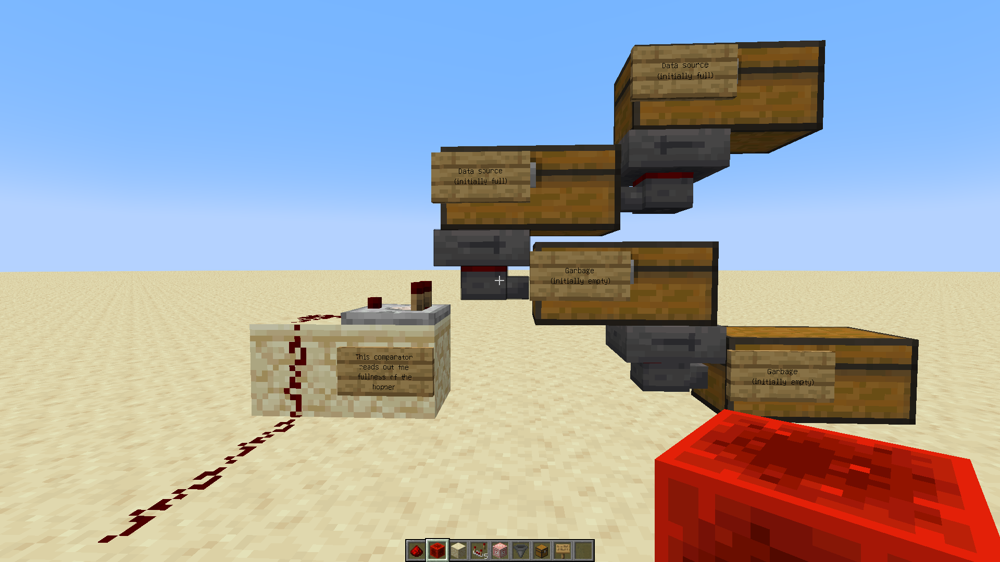
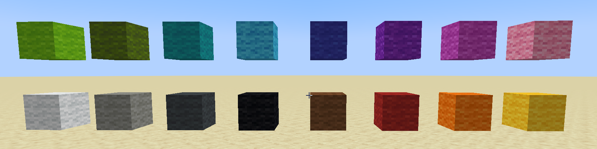
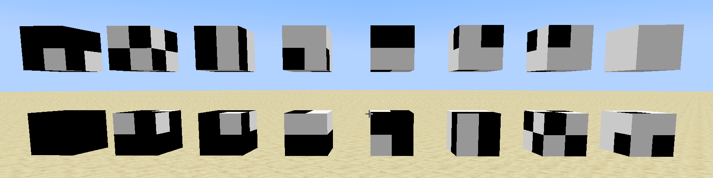
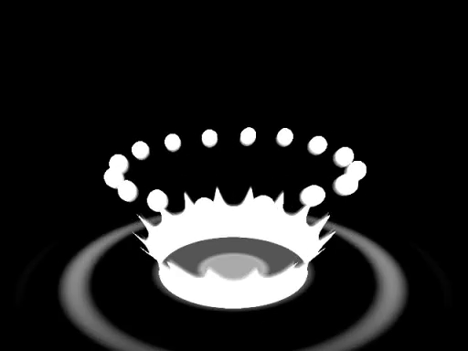

Demoscene is the art of pushing computers to perform tasks weren't designed to handle. One common theme in demoscene is the shadow-art animation "Bad Apple!!". We've played it on the Commodore 64, [Vectrex](https://en.wikipedia.org/wiki/Vectrex) (a unique game console utilizing only vector graphics), [Impulse Tracker](https://www.youtube.com/watch?v=SDvk3aL78fI), and even [exploited Super Mario Bros.](https://tasvideos.org/6012M) to play it.

But how about Bad Apple!!... in Minecraft?


### Video

TODO: [video here]


### Credits

This project required a great deal of ingenuity. In this post, I'll detail how it came together, but first, I want to thank some incredible people who made it possible:

- [Yuki](https://github.com/yuki0iq), for inventing several core techniques, gathering raw data and preprocessing it with ffmpeg (I hate ffmpeg).
- [Mia](https://github.com/miabaka), for testing performance on a high-end PC and getting me up-to-speed on dithering techniques.
- [kira](https://github.com/q60), for testing performance, recording the video, and rubber duck debugging.


### Try it out

TODO: World download

On low-end devices, you might have to install [VulkanMod](https://modrinth.com/mod/vulkanmod) (preferably) or [Sodium](https://modrinth.com/mod/sodium) (if Vulkan is unavailable) for satisfactory performance. **Avoid** [C2ME](https://modrinth.com/mod/c2me-fabric), as its autosaving facilities lead to performance regressions.


## The story

### Prologue

I'm not the first to attempt this, but I believe I came closer to perfection than anyone before me:

- The video plays at 20 fps, the highest frame rate possible in Minecraft.
- The image resolution is $512 \times 384$, just like the original animation.
- It's grayscale, not just black-and-white.
- On modern CPUs and GPUs, you can join a world and see the demo play at 20 fps exactly. I didn't speed up the video after recording. This is really hard to achieve, as Minecraft's engine is pretty slow.
- It uses no command blocks.


## Setting the scene

### Rules

I do things not because they are easy, but because they are hard. Before diving in, let's rule out some incredibly easy, almost cheaty ways to run Bad Apple!! in Minecraft:

1. Using mods is not okay. Sodium and other optimization mods can be used for testing on low-end devices, but the video must play in real-time on high-end devies on vanilla.
2. Using command blocks to achieve 20 fps or use `/setblock` is not okay.
3. Using datapacks, which are basically another way to use commands, is not okay.
4. Using animated textures is not okay.


### Prior art

I didn't want to go into this blind, so I tried to find what others did before me. Thanks for motivating me to do my best!

|Author + video link|Frames|Resolution|Colors|Slower than real-time?|Method|
|---------------------|------|----------|------|-----------|------|
|[Sloimay](https://www.youtube.com/watch?v=9jW6WyRoDAQ)|30 fps|$96 \times 72$|B/W|$6 \times$ (simulation only)|Command blocks|
|[Sloimay](https://www.youtube.com/watch?v=JUJUwZbl304)|15 fps|$64 \times 48$|B/W|$300 \times$|Pure redstone|
|[Mod Punchtree](https://www.youtube.com/watch?v=AY5ROo13oIM)|2 fps|$32 \times 24$|B/W|$\ge 10 \times$, hard to estimate|Pure redstone (MPU 8)|
|[Mod Punchtree](https://www.youtube.com/watch?v=LCipkEvrBRg)|12 fps|$64 \times 48$|B/W|$250 \times$|Pure redstone (IRIS)|
|[Green_Jab](https://www.youtube.com/watch?v=BakQ6GrHvqs)|5 fps|$40 \times 30$|B/W|Real-time!|Pure redstone|
|[SleeperPin](https://www.youtube.com/watch?v=4tPdhZFirMU)|5 fps|$15 \times 12$|B/W|Real-time!|Pure redstone (23w45a only)|
|[NuclearShadow](https://www.youtube.com/watch?v=4ZYzYNzxhKE)|4 fps|Small|B/W|Real-time, probably|Command blocks (+ particles)|
|[catlord5](https://www.reddit.com/r/Minecraft/comments/1dq1tcd/bad_apple_full_res/)|30 fps|$512 \times 384$|$\ge 10$|$\approx 40 \times$|Datapacks|
|[Naratna](https://www.reddit.com/r/Minecraft/comments/1dq1tcd/bad_apple_full_res/)|20 fps|$56 \times 42$|$8$|Real-time!|Datapacks + structures|
|[I_Really_Like_Stairs](https://www.reddit.com/r/Minecraft/comments/siyi4c/i_made_bad_apple_using_only_redstone_this_is_the/)|10 fps|$20 \times 15$|B/W|$\approx 20 \times$|First 150 frames only|
|[Klinbee](https://www.youtube.com/watch?v=RN3QW9SVnds)|||||Honorary mention|


### Back of the napkin

Most of these attempts used really small screens, compared to the original animation. The video by catlord5 was an exception, but it rendered $40 \times$ slower than I'd liked it to. This was hardly a surprise: Minecraft has a very slow game engine (for the dumbest reasons), so I'd need lots of clever optimizations.

Minecraft's simulation engine is notoriously slow, but its rendering engine isn't much better. While Sodium optimizes the latter, I wanted to achieve real-time performance on vanilla too. Rendering a $16 \times 16 \times 16$ chunk is slow independent of its contents, so the fewer chunks the screen spans, the better.

20 fps is hard to achieve for another reason. Redstone can't run faster than 20 ticks per second, so any practically usable clock generators emit 10 Hz signals, which is not enough to get 20 fps. In fact, it's even worse: redstone dust is, like, the only component that doesn't introduce tick delays, but [it's very laggy](https://empireminecraft.com/threads/a-guide-to-lag-busting-%E2%80%93-the-things-you-can-do.84889/), because no one at Mojang seems to know graph algorithms.

Oh boy, I'm not going to finish this over a weekend.


## How it started

### Data source

Ironically, the most challenging part of this project was figuring out how to store raw frames in Minecraft.

There's really few popular ways to store data.


### Hopper line

The most popular one is to store items in chests and take them out with hoppers:



Hoppers take the items out in the same order they are put in. Comparators emit the fullness of the containers they are connected to as a power level. Some items can be disambiguated by their fullness (e.g. a cake weighs $64 \times$ more than dirt), so this effectively stores a sequence of bits.

The problem is that hoppers have a delay of 0.4s between transferring items, reducing the maximum possible frame rate to 2.5 fps. To achieve 5 fps (or 10 fps with [interlaced video](https://en.wikipedia.org/wiki/Interlaced_video)), two hoppers need to be run concurrently, which is difficult to tile. Honest 10 fps require 4 hoppers, and hoppers are damn slow to simulate. And I wanted 20 fps.

This wasn't going to work.


### Packed binary

If I couldn't decrease latency, what about increasing throughput?

Minecraft has music discs, which, when put into jukeboxes and read out via comparators, emit a number from 1 to 15, depending on the disc. That's almost 4 bits; with luck, I'll figure out how to pad it to 4 bits exactly, and then I'll spread these 4 bits over time, increasing the frame rate from 2.5 fps to 10 fps (if 1 hopper is used) or to 20 fps (if 2 hoppers are used).

Shifting bits, however, requires quite a bit of logic, and redstone dust is slow. I made a prototype and, lo and behold, it was in fact slow, as predicted. (I'm smart.)

I needed something simpler.


### Repeater line

Let's dumb it down by borrowing I_Really_Like_Stairs's idea. It's the most stupid way of storing data I could think of: just a line of repeaters acting as a delay line, pre-configured to emit the right values at the right moments:


This enables tileable 1x1 pixels. Unfortunately, it seems to be *really* slow: I_Really_Like_Stairs's video had $650 \times$ smaller resolution than my target, contained only the first 150 frames, and had to be sped up $20 \times$ anyway. So even this very simple solution was not going to cut it.


### Structures

Okay, I give up. Is there something that isn't quite redstone, but is still considered more or less vanilla?

Hmm, there's something called [structure blocks](https://minecraft.wiki/w/Structure_Block). They aren't obtainable in survival, but they aren't nearly as overpowered as command blocks. They act like Ctrl-C/Ctrl-V of sorts:  a structure block put into `SAVE` mode can store a region of blocks to memory to a named location, and a `LOAD` structure block can load it to another place. Structure blocks can be activated by redstone, so it's as simple as connecting a structure block to a clock, right?


### Disclaimer

You might think this is cheating. It's not "real" redstone, so it doesn't count. But I think that's an ignorant point of view.

We like redstone because it lets us build complicated mechanisms, like computers, from simple and limited components. We dislike commands because they reduce large redstone builds to just one command, almost laughing at redstone builders.

In my opinion, **structstone** is much closer to redstone than commands. Whatever we're going to achieve is not going to be easy in the slightest. It's not as simple as "put blocks at the right places". In fact, we haven't even started. There's going to be *a lot* of reverse-engineering, techniques borrowed from video codecs, and other clever solutions down below. Some of the problems pushed me to the limit, and perfecting the solutions required collaboration with other people.

If this is your hard boundary, I'm sorry. If it isn't, keep reading -- I promise I won't disappoint you.


## How it's going

### Animation

Structure blocks are easy to use. You place the blocks you wish to save and a structure block nearby, configuring it to `SAVE` the region to a named location. You then activate the block. To load the region, you place another structure block, configure it to `LOAD`, and activate it with a redstone signal (a button in the screenshot below):


But how do you *animate* anything? Loading the same structure repeatedly is not going to cut it.

Guess what? The area a `LOAD` structure block affects can overlap with the structure block itself. So, a structure block can replace itself with another structure block configured to load a different structure!


In theory, when the "`LOAD` from red" block is activated, it should load a red wool block but also replace itself with a "`LOAD` from yellow" block, so the colors should alternate between activations.

In practice, there's a *big* lag spike, a *yellow* wool block is spawned instead of a red one, and the redstone dust stays powered despite the button being unpressed:


Can you guess the reason?

When the "`LOAD` from red" block is activated, it places a red wool block and a new structure block. It then sends updates to these blocks. The new structure block receives an update, detects the nearby activated redstone dust, and activates immediately. This loads a yellow wool block and another structure block. It then sends updates to these blocks. The new structure block receives an update...

This recursion ends when Minecraft hits a hard limit, which by luck results in a yellow block being spawned instead of a red one. The limit runs out before Minecraft fully processes the redstone dust depowering, so the power levels along the line only partially update, turning from $15, 14, 13, 12, 11$ to $7, 8, 9, 10, 9$ instead of $0, 0, 0, 0, 0$ as expected.

Theoretically, [zero-ticking](https://minecraft.wiki/w/Tutorials/Zero-ticking) should prevent this, but I've had enough of theory. Let's just add a delay with a repeater:


These structures should be built under `/tick freeze`, so that the repeaters are turned off. This way, when the structure is loaded, there's a 1 redstone tick delay before replacing the structure:


### Activation

This mechanism can be paused by locking the repeater:


A simpler mechanism can control starting (without pausing) with a single button:


When the button is pressed, the solid block gets weakly powered and immediately activates the structure block. The structure immediately replaces the solid block with a repeater, which ignores the dust, so no infinite recursion happens. After the last frame, the structure block can place the solid block back to allow restarting.


### Ticks

There are two kinds of ticks in Minecraft: redstone ticks and game ticks. The game engine recomputes physics at 20 Hz (game ticks), but redstone logic is only recomputed at 10 Hz (redstone ticks). At least, that's the common explanation.

In reality, all events are processed at $0.05$ s intervals; it's just that redstone components schedule their updates in multiples of $0.1$ s. So, if an event initiated by the user happens at $13.20$ s, redstone may respond at $13.20$ s, $13.30$ s, $13.40$ s, etc. And if the event occurs $0.05$ s later, redstone will respond $0.05$ s later too.

So far, we've seen colors alternating 10 times per second. For 20 fps, we need 4 structures:


The small pink cubes indicate *structure voids*: blocks that aren't replaced when the structure is loaded. By default, even air can replace blocks, so these voids let us overlap structures.

The red and yellow structures form one 10 Hz clock, while the blue and green structures form another 10 Hz clock. Both clocks place the wool at the same position, so if the structures are activated at the right offset, four colors alternate at 20 Hz:


This video was recorded by manually activating the two clocks at different times so that they run in different phases. To streamline this process, we can use a long-standing bug where pistons pushing redstone blocks take 3 game ticks to extend when activated directly by user input. This way, pressing a single button activates the mechanism with 100% success:


### The End?

To make a screen, all we have to do is place a large grid of wool instead of just one block.


Oof, that was tiresome, and that was just 48 block tall towers. I need... 384 blocks vertically? Wait, how tall are Minecraft worlds, anyway? That's 384 blocks, i.e. 24 chunks. And it's going to be 32 chunks horizontally. The maximum render distance is 32 chunks, so I'll probably have to play around with FOV...

Wait, *how many chunks*? There's a reason 32 chunks is the limit in vanilla: few devices can handle that. And unlike survival worlds, all those $32 \times 24 = 768$ chunks will constantly be updated at 20 Hz! That's just not going to work.

Back to the drawing board?


## Or the beginning?

### Goal

Minecraft renders blocks in $16 \times 16 \times 16$ chunks. Whenever any block in the chunk changes, the whole chunk is rerendered. This takes a while because Mojang supports a lot of legacy code. To address this, we need to decrease the number of chunks without sacrificing resolution.


### Textures

That's as impossible as placing blocks automatically. In other words, it's possible if we introduce new tools.

Minecraft supports custom textures through resource packs (not to be confused with datapacks). We can replace the textures of several -- say 16 -- distinct blocks. 16 variants translate to 4 bits, which correspond to "subpixels" of a block:





We can go futher. By taking $4^4 = 256$ blocks and adding two more colors to the subpixels, we can shift from black-and-white to grayscale.

We've just reduced the block resolution $4 \times$, to $256 \times 192$, losslessly. That gets us down to 192 chunks updated at 20 Hz.

This is still a large number of chunks, but it's manageable. The worst that can happen if there are too many updates is a decreased frame rate, right?


## There are nuances

### Background

You see, Minecraft's rendering engine is tuned for the players, not whatever this is, so it prioritizes updates in nearby chunks.

Several threads build chunks concurrently. Whenever a chunk is updated, it's added to a queue, and threads fetch the closest chunk to the player from the queue to rebuild.

If there are $N$ threads and the $N$ chunks closest to the player are updated so frequently that the workers barely finish processing them fully before they are updated again (20 times per second), *nothing* but those $N$ chunks will ever be rendered.

You can partially observe this effect here:


The towers clearly glitch in the middle occasionally because they span three chunks, so sometimes only two chunks are rendered in time.

We got lucky here: the render threads eventually catch up with the updates. However, in the actual demo, I needed to ensure that there was enough free time each tick for the render threads to catch up with older updates.


### Optimization

According to [Spark](https://spark.lucko.me/), the bottleneck in my demo was just updates in general. It wasn't even redstone or light updates, it was just `setBlock` and event handlers. The only way forward was to reduce the number of updates.

The simplest way to do that is delta coding. The concept is straightforward: since most frames change very little, only the blocks that differ between frames should be updated. In theory, this should improve performance in most scenes.

This sounded like a solid plan, so I began prototyping.


### Prototype

A structure block can only load $48 \times 48 \times 48$ blocks at once, so I had to tile $6 \times 4$ smaller $48 \times 48$ screens.

Instead of preparing the data by hand, I generated [structure files](https://minecraft.wiki/w/Structure_file) with a script. I extracted frames from a video with `ffmpeg`, loaded them into Python with `Pillow`, and generated [NBT](https://minecraft.wiki/w/NBT_format) files with [nbtlib](https://pypi.org/project/nbtlib/).

Unfortunately, I don't have any screenshots from this period. The code ran slowly (about 7 minutes per run), the result was hard to launch (`/tick freeze`, press 24 buttons, `/tick unfreeze`), but it worked.

One problem: it was still too slow, even with delta coding. I knew my PC was old, but I doubted throwing more hardware at it would solve the issue sufficiently.


### Brainstorming

Increasing subpixel density in a block was not feasible: a $3 \times 3$ resolution would require $4^9 = 262144$ blocks, far more than Minecraft has. Reducing color resolution to black-and-white was an option, but it wouldn't be ideal. What did I have left?

That's when I found an intriguing note on [the wiki page for models](https://minecraft.wiki/w/Model). Models specify block shapes: while most blocks are just cubes, some aren't, like composters or stairs. Shapes are composed of cuboids specified by XYZ coordinates of two corners, with `(0, 0, 0)` for the front bottom left corner and `(16, 16, 16)` for the back top right corner. But the coordinates of the cuboids can range from $-16$ to $32$, 3 times wider than the block itself.

So with the right configuration, a block could render as if it was up to $3 \times$ larger than it should be, replacing 9 blocks. This is only applicable in some common cases, like a totally black or a totally white $6 \times 6$ pixel square, because there weren't nearly enough blocks for all possible combinations. According to my calculations, there were about $600$ usable blocks in Minecraft, so I had $600 - 256 = 344$ blocks for this optimization. Or a bit fewer than that, because some of the blocks would be used for decoration.

After experimenting with some heuristics and block sizes, I settled on the following approach:

> The screen is divided into a $2 \times 2$ block grid, with each cell containing 4 blocks (16 pixels). Each possible $4 \times 4$ pixel sprite is a candidate for optimization into a single block. Throughout the algorithm, ranks of various sprites are computed. At the end, as many sprites as possible are assigned blocks, with higher ranks prioritized.
>
> The ranks start at $0$. For every two consecutive frames, the difference between them is calculated, and cells that changed between frames have their ranks incremented (both old and new versions). The increment is proportional to the number of changed pixels between frames, so a cell changing in a fast scene weighs more than in a slow scene.

This worked! On Mia's and kira's devices, anyway. It lagged on my device, so I experimented with optimization mods for local testing, eventually settling on VulkanMod for rendering. With this client-side optimization, the animation didn't fall behind in the long run, though it remained somewhat laggy.


## Just a little bit more

### Goal

There were still some things I wanted to improve, like bit depth (i.e. the number of colors) and the count of optimized $2 \times 2$ blocks. Both of these issues hinged on getting access to significantly more than the $600$ built-in blocks.

I've looked high and low for ways to add custom blocks, but all I found were tricks based on wrapping existing blocks in notoriously laggy item frames. And then...


### Blockstates

I looked at Minecraft's packed assets again and found this in `assets/minecraft/blockstates/oak_log.json`:

```json
{
  "variants": {
    "axis=x": {
      "model": "minecraft:block/oak_log_horizontal",
      "x": 90,
      "y": 90
    },
    "axis=y": {
      "model": "minecraft:block/oak_log"
    },
    "axis=z": {
      "model": "minecraft:block/oak_log_horizontal",
      "x": 90
    }
  }
}
```

It's possible to choose different models for a single block depending on its properties. Some blocks, like `grindstone`, have more complicated blockstate information, indicating that it's possible to use combinations of properties as keys:

```json
{
  "variants": {
    "face=ceiling,facing=east": {
      "model": "minecraft:block/grindstone",
      "x": 180,
      "y": 270
    },
    "face=ceiling,facing=north": {
      "model": "minecraft:block/grindstone",
      "x": 180,
      "y": 180
    },
    ...
  }
}
```

With a quick script to extract variants from default assets, I could enumerate all blockstates, rather than just blocks.

```bash
for name in *; do echo -n $name; jq -c '. as $dot | try [[$dot.variants | keys[] | split(",") | [.[] | split("=") as [$key, $value] | {$key: $value}]] | transpose[] | unique | {"key": first | to_entries | .[].key, "value": [.[] | to_entries | .[0].value]}] catch [[$dot.multipart[].when] | del(.[] | nulls) as $data | $data? | [.[] | keys | .[0]] | unique | .[] | . as $key | {$key, "value": [$data | .[][$key]] | del(.[] | nulls)}] | from_entries' <$name; done
```

After filtering out unusable blockstates (e.g. the `shape` property of stairs is always recomputed automatically, so I couldn't control it), this increased the count of accessible models from $600$ to about $1700$. This enabled me to increase the number of colors to 6 and the number of optimized blocks to $400$.


## Mechanics

### Audio

With video playback out of the way, it was time to turn to other matters. One feature addition I thought would be nice was music.

Resource packs can change the music played by discs. The duration of the music disc stays fixed even if the audio is replaced, so I used *Relic* as the music disc since it has the closest duration to "Bad Apple!!". Just for fun, I replaced the name of the disc with a language file (`assets/minecraft/lang/en_us.json`), so that the in-game subtitles say "Now Playing: Bad Apple!!" when the disc is played:

```json
{
    "jukebox_song.minecraft.relic": "Bad Apple!!"
}
```

To control when the music is played, I hooked up a jukebox to a dropper controlled by a button:


The dropper contains one music disc. When the button is pressed, the dropper is activated and transfers the disc to the hopper. The hopper then moves the disc to the jukebox, starting playback. When the jukebox stops playing the disc, the hoppers unlock, and the disc is transferred to the dropper by the bottom-right hopper, ready to be inserted again.

There were some troubles with quasiconnectivity: the jukebox emits a redstone signal while playing music, so the hoppers are powered, which in turn powers the dropper by QC. When the music ends, the dropper is not updated and remains powered, so the next button press doesn't start the music again.

The workaround is as follows:


When the button is pressed, the dust is powered, which in turn updates the dropper by QC (because the taxicab distance between the components is $2$). The dropper realizes it should reset and switches off. One redstone tick later, the repeater powers the dropper again, and the disc is inserted.

Any other method of delaying the signal works too, not just with repeaters.


### 3... 2... 1...

For some final UX improvements, it'd've been pretty good if the demo could be started without, you know, needing to press 25 buttons under `/tick freeze`.

For the viewer to see the whole screen at once, they had to be positioned far enough away. I didn't want the wiring to be visible, and replacing the models for redstone dust and repeaters with empty ones felt like bad taste. In addition, this would inevitably introduce significant delays, which I wanted to avoid, and hiding instant wire sounded like overengineering, if it even was doable.

What I really wanted was essentially wireless redstone. Sculk sensors wouldn't work at such a long distance, so I had to find another solution. I was about to use [2No2Name's system](https://www.reddit.com/r/technicalminecraft/comments/n5wshk/new_highspeed_wireless_redstone_device_based_on/)...

...but then I remembered something I stumbled upon while figuring out how to draw animation with structure blocks. I encountered a bug where triggering a recursive structure block attempted to perform all the recursive loads in a single tick. What if I used that feature benevolently?

Yuki helped me devise a way to create instant wire using structure blocks. It's not a perfect wire since it only transfers pulses, but it works for my use case:


Whenever the button is pressed, the structure block loads a *powered* redstone torch over the unpowered torch in the middle component. This torch gets unpowered on the next tick because it's sitting on a redstone block, but before that happens, it activates another structure block. This structure block spawns a powered redstone torch in the third component, triggering the lamp.


A structure block spans up to $48$ blocks, so this method helped me transfer startup signals across a grid of $48 \times 48$ subscreens.


### 0... -1... -2...

It, however, didn't help transfer the signal from the viewer to behind the screen, as that distance was about $150$ blocks. Using torches was convenient because they didn't need to be manually reset -- each torch was disabled by the redstone block in the next tick, ready for the next pulse. In this case, though, I had to add reset facilities to the mechanism myself.

The idea was simple. When a button is activated, a structure block should spawn another structure block sitting atop a redstone block. That structure block will activate immediately and should replace itself and the redstone block with air, while also spawning another structure block + redstone block construct further along the line. This repeats until the signal reaches the receiver.

In practice, this can't be built in creative because placing a structure block and a redstone block next to each other activates the structure block immediately, without enough time to save the construct in the deactivated state. (I did manage to work around this once, but I can't reproduce it.) Luckily, I had a Python library to generate structure files from [LISPy code](https://en.wikipedia.org/wiki/Greenspun's_tenth_rule), so getting the instant wire working was as simple as writing it out by hand in a straightforward format:

```python
# ...
structure(
    "starter2",
    (22, 2, 48),
    air((0, 0, 47)),
    air((0, 1, 47)),
    redstone_block((21, 0, 0)),
    structure_block((21, 1, 0), offset=(0, -1, -47), size=(1, 2, 48), name="starter3")
)
# ...
```


### Box

With all the mechanisms ready, I combined them in a small $4 \times 2 \times 3$ box, activated by an outside button:


## Preparing frames

### Setup

Now that the playback system was set up and ready, I could spend some time polishing the video material itself. It seemed like a strange task, given that the hardest, most interesting part was already behind me, but it made for a nice change of pace.

There were two main issues to solve:

- How do I translate a full-color video to 6 colors, producing the highest quality picture?
- How do I translate a 30 fps video to 20 fps?


### Colors

Some people believe "Bad Apple!!" is purely black-and-white, but there are *many* contexts in which it uses full-color grayscale.

Motion blur:


Glow and objects of different brightness:


Gradients between scenes:


In high-speed scenes, the motion blur is enchanced by overlapping 5 frames of an $\approx 200$ fps video with different opacity, leaving a trace:


Blur (the girl in the background) and gradients:


Fire:


The sun:


Shadows:


Ripples in water:



Simply rounding to the nearest representable color doesn't do these frames justice, introducing [banding](https://en.wikipedia.org/wiki/Colour_banding):


This is typically solved by dithering, a technique where an area of pixels of non-exactly representable colors is translated into a pattern of interleaved close representable colors:


There's just one problem. High-quality dither algorithms are complex beasts, and the results they produce, though great, depend heavily on the original image. For animation, this means that two consecutive frames, while "close" to a human eye, may produce radically different dithered outputs. This is troublesome for two reasons:

- A human eye can easily notice this inconsistency.
- This leads to many updates, especially in fast-paced scenes, more than Minecraft can reasonably handle.

Luckily, "local" dither algorithms exist, like [Bayer dithering](https://en.wikipedia.org/wiki/Ordered_dithering):


However, subjectively, their results are of worse quality than "global" algorithms, failing to completely remove banding. Fortunately, there's a middle ground [solution](https://en.wikipedia.org/wiki/Ordered_dithering#Void_and_cluster) based on blue noise. In short, a certain kind of grayscale noise is added to the frames pixelwise, and the pixels are then rounded to the nearest representable colors. The two non-Bayerian pictures above demonstrate this method using GIMP.

Unfortunately, `ffmpeg`, the tool I used to generate video, doesn't support blue noise dithering, so I had to take a texture from [Christoph Peters's blog](https://momentsingraphics.de/BlueNoise.html), crop it to $512 \times 384$, and apply dithering manually with a script in Rust. (I didn't want to wait half an hour for Python to finish, only to discover an off-by-one error.) The result was a bit worse than the examples above, as I had to choose one palette for all frames, but it was still good enough:


### Frame rate

Transforming 30 fps to 20 fps sounds like a no-brainer. Just drop every third frame. But there's a reason we don't just drop every third pixel while resizing an image, and the same principle applies to the time axis.

Suppose there's an object moving with constant velocity across several frames. Before downsampling, the object travels the same distance between consecutive frames. After downsampling, the object travels twice as much in odd frames as in even ones.

This is jarring to the human eye! In addition, this means that odd frames usually contain twice as many updates as even frames, resulting in a saw-like pattern in the MSPT (milliseconds per tick) plot.

Unfortunately, we couldn't find a better solution. While there are many 60 fps videos of "Bad Apple!!" online, these videos were upscaled using AI or other automatic tools. Neither stood a chance against fast-paced scene changes, producing tons of artifacts.


## So long, and thanks for all the fish

### Retrospective

And... that's it? Looking back, the result looks almost trivial to achieve, which raises the question of why no one has done it before.

It was certainly a winding path, with many dead ends I didn't mention. I started with a $48 \times 36$ screen and 2 colors, reached $128 \times 96$ and 10 colors, then increased the resolution to $256 \times 192$, and finally reduced the number of colors to 6 to achieve $512 \times 384$. I even attempted to play the music with note blocks, only to realize that achieving good quality might as well be a whole 'nother project. I invented structstone and began prototyping a full-blown computer using this technique.

I played around with `ffmpeg`, switched to `mpv` as my go-to media player, and finally got around to trying out [the image crate](https://lib.rs/image). I wrote code during SSRI-induced sleepless nights. I treated this project like a hackaton, sacrificing code quality for development speed, only to realize I didn't fully account for [the Pareto principle](https://en.wikipedia.org/wiki/Pareto_principle). I read Minecraft's decompiled code and wrote [a post](../ru/minecraft-compares-arrays-in-cubic-time/) about what I found. I even used various tricks to minimize the world's directory size.

This was a fun experience. Even though it took more than a month, and I grew tired and a bit resentful, I enjoyed thinking outside the box and collaborating with friends. It was a refreshing change of pace compared to my usual projects. Honestly, I think every developer should try to build something like this for a while. Who knows what you might invent?
