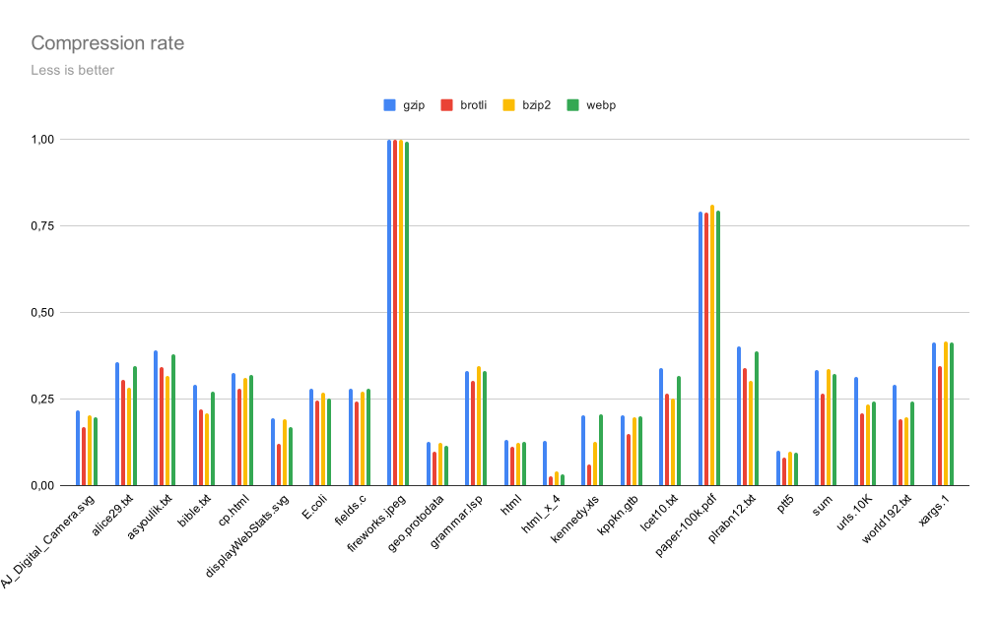
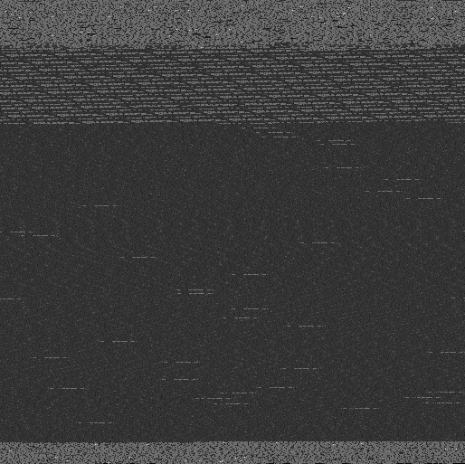

I want to provide smooth experience to the visitors of my site, so I work on accessibility and ensure it works without JavaScript enabled. I care about page load time because some of my pages contain large illustrations, so I minify my HTML.

But one *thing* makes turning my blog light as feather a pain in the ass.


### The hurdle

See, the major win in traffic reduction (and thus latency savings on mobile!) comes not from minification, but from compression. HTTP supports gzip and brotli via the `Content-Encoding` header. This is opt-in, because compression takes resources, and sometimes transferring uncompressed data is just faster.

Typically, brotli is better than gzip and gzip is better than nothing. gzip is so cheap everyone enables it by default, but brotli is way slower.

Annoyingly, I host my blog on GitHub pages, which doesn't support brotli. So [Recovering garbled Bitcoin addresses](../recovering-garbled-bitcoin-addresses/), the largest post on my site, takes `92 KiB` instead of `37 KiB`. This amounts to a totally unnecessary `2.5x` increase in load time.


### A naive idea

There's no *reason* why GitHub can't support brotli. Even if compressing files in-flight is slow, GitHub could still allow repo owners to upload precompressed data and use that.

GitHub doesn't do that for us, but we can still take advantage of precompressed data. We'll just have to manually decompress it in JavaScript on client side.

Like a good developer, the first thing I do upon finding a problem is search for a solution on Google. [brotli-dec-wasm](https://www.npmjs.com/package/brotli-dec-wasm) turned up after a quick search, providing a `200 KB` brotli decompressor in WASM. [tiny-brotli-dec-wasm](https://www.npmjs.com/package/tiny-brotli-dec-wasm) is even smaller, at `71 KiB`.

Alright, so we're dealing with `92 KiB` for gzip vs `37 + 71 KiB` for brotli. Umm...


<cut></cut>

### Fool me twice

Why would I need WASM in the first place? My browser certainly has a brotli decoder in its HTTP stack, does it have an API or something?

Actually, it does! [Compression Streams API](https://developer.mozilla.org/en-US/docs/Web/API/Compression_Streams_API) provides exactly that. For example, the constructor of [DecompressionStream](https://developer.mozilla.org/en-US/docs/Web/API/DecompressionStream/DecompressionStream) takes the `format` argument, documented as:

> One of the following compression formats:
>
> - `"gzip"`
>
>   Decompress the stream using the GZIP format.
> - `"deflate"`
>
>   Decompress the stream using the DEFLATE algorithm in ZLIB Compressed Data Format. The ZLIB format includes a header with information about the compression method and the uncompressed size of the data, and a trailing checksum for verifying the integrity of the data
> - `"deflate-raw"`
>
>   Decompress the stream using the DEFLATE algorithm without a header and trailing checksum.

Wait, where's brotli? Oh, it just doesn't exist for... [reasons](https://github.com/whatwg/compression/issues/34). This might hopefully change soon, but that's not where we are at at the moment, and you know how slowly these things progress.

I also briefly contemplated using `gzip` anyway, but precompressing gzip with a more efficient library -- `zopfli` -- only managed to produce a `86 KiB` file, still significantly worse than brotli.


### Breaking laws

I was about to give up, but then I remembered a cool technique from [demoscene](https://en.wikipedia.org/wiki/Demoscene).

Browsers can decode images. Images are typically compressed. So we can encode data in pictures and decode it via Canvas API, and *if* the image compression is lossless and efficient enough, it's going to be a net win.

I hope you see where I'm going with this and are yelling "oh why the fuck" right now.

The simplest compressed lossless image format is GIF. GIF simply flattens the image in row-major order and applies [LZW](https://en.wikipedia.org/wiki/Lempel%E2%80%93Ziv%E2%80%93Welch), a very dated (1984) compression scheme. gzip uses DEFLATE, which was designed to replace LZW, so we're not going to score a win here.

PNG also uses DEFLATE, but vitally, it passes image data through another transform beforehand. Instead of compressing the raw pixel data, DEFLATE is applied to the difference between neighboring pixels, e.g. to `[a, b-a, c-b, d-c]` instead of `[a, b, c, d]`. (Other, slightly more complicated transforms are also possible.) In effect, this makes PNG a predictive format: instead of storing raw data, the difference from prediction ("error") is stored, which is small in most cases (yay, probability asymmetry, Huffman likes that).


### Oh God no

But the real winner here is [WebP](https://developers.google.com/speed/webp/docs/webp_lossless_bitstream_specification), the format half the lunatics believe is the creation of the devil and the other half believes is a treasure. WebP has two variations: lossy and lossless, using completely different approaches. We're talking about VP8L the lossless format here.

VP8L is similar to PNG. It uses a predictive transform, slight more complicated than PNG's, but the better part is that Google replaced DEFLATE with a hand-rolled DEFLATE-like method.

DEFLATE enables you to split the file into pieces and use a custom Huffman tree for each piece. This is reasonable: in practice, data is not uniform, so different parts have different character and backreference probability distributions. For example, JavaScript, SVG, and markup will probably use different trees when embedded into one HTML file.

VP8L supports this too, but with a twist. A WebP file can define an arbitrarily large table of distinct Huffman trees and then use different trees for each 16x16 pixel block. Crucially, this enables table reuse. Where in DEFLATE, JavaScript followed by CSS followed by JavaScript would require three trees to be encoded despite the 1st and the 3rd one being quite similar, VP8L would require just two tables. In addition, this enables more locality, because tables are cheaper to switch often.


### More tweaks

Another cool thing VP8L has is the *color cache*. Here's a neat demonstration of a similar technique.

Suppose you're writing a really stupid JSON compressor. You might want to encode marker characters like `"`, `[`, `]`, `{` and `}` efficiently. It turns out that sometimes, just saying "this character is a marker" is enough to infer the exact value. For example, in `"s<MARKER>`, the marker is clearly `"`, and in `[1, 2, 3<MARKER>` it's clearly `]`.

The idea here is similar. Sometimes, instead of storing the exact pixel, it suffices to just store an indication that we want a copy of the most recent pixel with a certain property (e.g. a 6-bit hash).


### Trying it out

I'm going to use the [Recovering garbled Bitcoin addresses](../recovering-garbled-bitcoin-addresses/) post as a benchmark for now.

```shell
$ curl https://purplesyringa.moe/blog/recovering-garbled-bitcoin-addresses/ -o test.html

$ wc -c test.html
439478 test.html

$ gzip --best <test.html | wc -c
94683
```

Good. Let's use the [webp](https://docs.rs/webp/latest/webp/) crate for a quick compression test.

```shell
$ cargo add webp
```

```rust
fn main() {
    let binary_data = include_bytes!("../test.html");

    // Umm... 1xN?
    let width = binary_data.len() as u32;
    let height = 1;

    // Convert to grayscale RGB
    let mut image_data: Vec<u8> = binary_data.iter().flat_map(|&b| [b, b, b]).collect();

    // Lossless, quality 100 (translates to best compression)
    let compressed = webp::Encoder::from_rgb(&image_data, width, height)
        .encode_simple(true, 100.0)
        .expect("encoding failed");

    println!("Data length: {}", compressed.len());
    std::fs::write("compressed.webp", compressed.as_ref()).expect("failed to write");
}
```

```shell
$ cargo run
thread 'main' panicked at src/main.rs:13:100:
encoding failed: VP8_ENC_ERROR_BAD_DIMENSION
note: run with `RUST_BACKTRACE=1` environment variable to display a backtrace
```

Umm, apparently WebP only supports pictures up to `16383x16383`. We can do that.

```rust
fn main() {
    let binary_data = include_bytes!("../test.html");

    // Umm... 16383xN?
    let width = 16383;
    let height = (binary_data.len() as u32).div_ceil(width);

    // Convert to grayscale RGB, padding the image to width * height
    let mut image_data: Vec<u8> = binary_data.iter().flat_map(|&b| [b, b, b]).collect();
    image_data.resize((width * height * 3) as usize, 0);

    // Lossless, quality 100 (translates to best compression)
    let compressed = webp::Encoder::from_rgb(&image_data, width, height)
        .encode_simple(true, 100.0)
        .expect("encoding failed");

    println!("Data length: {}", compressed.len());
    std::fs::write("compressed.webp", &*compressed).expect("failed to write");
}
```

```shell
$ cargo run
Data length: 45604
```

That's a good start. It's already 2x smaller than gzip. In fact, it's smaller than bzip2 at `49764` bytes!


### Shenanigans

We can, however, do better by applying WebP-specific tricks.

For one thing, using a *wide* image with a row-major order means that 16x16 blocks contain bytes from far away (the first 16 consecutive pixels are from the first 16 KiB of input, the next ones are from the next 16 KiB of input). Let's use a tall image instead.

```rust
// Umm... Nx16383?
let height = 16383;
let width = (binary_data.len() as u32).div_ceil(height);
println!("Using {width}x{height}");
```

```shell
$ cargo run
Using 27x16383
Data length: 43232
```

The `cwebp` library provides a way to affect compression performance other than quality, called "method". Let's try it out.

```rust
// Lossless, quality 100
let mut config = webp::WebPConfig::new().unwrap();
config.lossless = 1;
config.quality = 100.0;

for method in 0..=6 {
    // Try different methods (4 is the default one)
    config.method = method;
    let compressed = webp::Encoder::from_rgb(&image_data, width, height)
        .encode_advanced(&config)
        .expect("encoding failed");

    println!("Method {method}, data length: {}", compressed.len());
}
```

```shell
$ cargo run
Method 0, data length: 48902
Method 1, data length: 43546
Method 2, data length: 43442
Method 3, data length: 43292
Method 4, data length: 43232
Method 5, data length: 43182
Method 6, data length: 43182
```

Let's settle for 5, it seems to be as good as 6 but faster.

We're `2.2x` better than gzip and `1.2x` worse than brotli at this point. Quite an achievement under our conditions.


### Benchmark

Just for fun, let's compare the formats on different files. I'm going to use [snappy's testdata](https://github.com/google/snappy/tree/main/testdata), [the Canterbury Corpus and the Large Corpus](https://corpus.canterbury.ac.nz/), and [two](https://upload.wikimedia.org/wikipedia/commons/1/18/Digital-camera_aj_ashton_01.svg) [large](https://dev.w3.org/SVG/tools/svgweb/samples/svg-files/displayWebStats.svg) SVG files.

I'll start by rewriting the script to be usable in a pipe:

```rust
use std::io::{Read, Write};

fn main() {
    let mut binary_data = Vec::new();
    std::io::stdin().read_to_end(&mut binary_data).expect("failed to read stdin");

    let width = (binary_data.len() as u32).div_ceil(16383);
    let height = (binary_data.len() as u32).div_ceil(width);

    // Convert to grayscale RGB, padding the image to width * height
    let mut image_data: Vec<u8> = binary_data.iter().flat_map(|&b| [b, b, b]).collect();
    image_data.resize((width * height * 3) as usize, 0);

    // Lossless, quality 100, method 5
    let mut config = webp::WebPConfig::new().unwrap();
    config.lossless = 1;
    config.quality = 100.0;
    config.method = 5;
    let compressed = webp::Encoder::from_rgb(&image_data, width, height)
        .encode_advanced(&config)
        .expect("encoding failed");

    std::io::stdout().write_all(&compressed).expect("failed to write to stdout");
}
```

(I also slightly changed the dimension computation to better suit data of different sizes.)

And then I'll compare gzip, bzip2, brotli, and webp on the corpus:

```bash
#!/usr/bin/env bash
cd corpus

printf "%24s%8s%8s%8s%8s%8s\n" File Raw gzip brotli bzip2 webp
for file in *; do
    printf \
        "%24s%8d%8d%8d%8d%8d\n" \
        "$file" \
        $(<"$file" wc -c) \
        $(gzip --best <"$file" | wc -c) \
        $(brotli --best <"$file" | wc -c) \
        $(bzip2 --best <"$file" | wc -c) \
        $(../compressor/target/release/compressor <"$file" | wc -c)
done
```

|                   File|    Raw|   gzip| brotli|  bzip2|   webp|
|-----------------------|-------|-------|-------|-------|-------|
|  AJ_Digital_Camera.svg| 132619|  28938|  22265|  27113|  26050|
|            alice29.txt| 152089|  54179|  46487|  43202|  52330|
|           asyoulik.txt| 125179|  48816|  42712|  39569|  47486|
|              bible.txt|4047392|1176635| 889339| 845635|1101200|
|                cp.html|  24603|   7973|   6894|   7624|   7866|
|    displayWebStats.svg|  85737|  16707|  10322|  16539|  14586|
|                 E.coli|4638690|1299059|1137858|1251004|1172912|
|               fields.c|  11150|   3127|   2717|   3039|   3114|
|         fireworks.jpeg| 123093| 122927| 123098| 123118| 122434|
|          geo.protodata| 118588|  15099|  11748|  14560|  13740|
|            grammar.lsp|   3721|   1234|   1124|   1283|   1236|
|                   html| 102400|  13584|  11435|  12570|  12970|
|               html_x_4| 409600|  52925|  11393|  16680|  13538|
|            kennedy.xls|1029744| 209721|  61498| 130280| 212620|
|              kppkn.gtb| 184320|  37623|  27306|  36351|  36754|
|             lcet10.txt| 426754| 144418| 113416| 107706| 134670|
|         paper-100k.pdf| 102400|  81196|  80772|  82980|  81202|
|           plrabn12.txt| 481861| 194264| 163267| 145577| 186874|
|                   ptt5| 513216|  52377|  40939|  49759|  49372|
|                    sum|  38240|  12768|  10144|  12909|  12378|
|               urls.10K| 702087| 220198| 147087| 164887| 170052|
|           world192.txt|2473400| 721400| 474913| 489583| 601188|
|                xargs.1|   4227|   1748|   1464|   1762|   1750|

Let's analyze this in a more intuitive way.



To start with, WebP is almost always better than gzip, except on very small files (grammar.lsp and xargs.1) and these ones:

|                   File|    Raw|   gzip| brotli|  bzip2|   webp|
|-----------------------|-------|-------|-------|-------|-------|
|            kennedy.xls|1029744| 209721|  61498| 130280| 212620|
|         paper-100k.pdf| 102400|  81196|  80772|  82980|  81202|

paper-100k.pdf is noise (the file contains 19 KB of XML followed by compressed data, so we're effectively measuring small data at this point).

I'm not sure what the deal with kennedy.xls is. The results are also strange because of the relative brotli/bzip2 performance. I believe that the reason is that this file contains a lot of heterogenous closely located data, which is notably difficult for compressors to handle.

WebP fares slightly worse than bzip2, overtaking it in some cases and losing in many others. This is hardly surprising, as the two use significantly different algorithms, so they're going to score differently on different data.

Unsurprisingly, WebP is always worse than brotli (except fireworks.jpeg, which is basically a uniformly random blob, so it's up to noise). Still, it provides a measurable improvement over gzip on large plain-text data, including the SVGs and, most notably, html_x_4, where it provides a `3.3%` compression rate, worse than brotli's `2.8%` but significantly better than gzip's `13%`.

All in all, WebP seems to be quite a good candidate for Web in particular.


### JavaScript

With that said, let's return to quote-unquote practical applications.

Decoding the WebP would be quite simple if Canvas API provided a reliable way to read pixels. It doesn't, for anti-fingerprinting reasons, so we have to resort to ugly WebGL hacks:

```html
<script type="module">
// Fetch WebP blob
const result = await fetch("compressor/compressed.webp");
const blob = await result.blob();

// Decode to RGBA
const bitmap = await createImageBitmap(blob);
const context = new OffscreenCanvas(bitmap.width, bitmap.height).getContext("webgl");
const texture = context.createTexture();
context.bindTexture(context.TEXTURE_2D, texture);
context.texImage2D(context.TEXTURE_2D, 0, context.RGBA, context.RGBA, context.UNSIGNED_BYTE, bitmap);
context.bindFramebuffer(context.FRAMEBUFFER, context.createFramebuffer());
context.framebufferTexture2D(context.FRAMEBUFFER, context.COLOR_ATTACHMENT0, context.TEXTURE_2D, texture, 0);
const pixels = new Uint8Array(bitmap.width * bitmap.height * 4);
context.readPixels(0, 0, bitmap.width, bitmap.height, context.RGBA, context.UNSIGNED_BYTE, pixels);

// The R channel is the raw HTML bytes
const bytes = new Uint8Array(bitmap.width * bitmap.height);
for (let i = 0; i < bytes.length; i++) {
    bytes[i] = pixels[i * 4];
}

// Decode UTF-8
const html = new TextDecoder().decode(bytes);

document.documentElement.innerHTML = html;
</script>
```

Why `readPixels` is not subject to anti-fingerprinting is beyond my understanding. Anyway, it doesn't sprinkle hardly visible typos all over the page, so that works for me.

WebGL only reliably supports textures up to `2048x2048`, so some bounds have to be updated.

This code minifies to about 550 bytes. Together with the WebP itself, this amounts to `44 KiB`. In comparison, gzip was `92 KiB` and brotli would be `37 KiB`.


### Polishing

One thing I hate about this solution is the goddamn flicker.

As `await` is implicitly rewritten to use promises, the browser believes that the script has finished execution before the WebP is downloaded. There's nothing in the DOM yet, so the browser shows an empty white page.

A hundred milliseconds later, the WebP is loaded, decoded, the HTML is parsed, CSS is downloaded, styles are computed, and only then is the DOM rendered to screen, replacing the nothingness.

A simple way to fix this is to keep the styling and the top of the page (about `8 KiB` uncompressed) in the gzipped HTML and only compress the content below the viewport with WebP. It's still going to feel junky when refreshing the page below the viewport, but it's still manageable.

Another nuisance is scroll behavior. Scroll position is usually retained upon refresh, but when you're at `Y = 5000px`, you refresh and the page is `0px` tall, it's reset. Temporarily adding a really huge `<div>` helps with this.


### Embedding

Finally, let's decrease the latency just a little bit more by embedding the WebP directly into JavaScript.

The simplest way to do that is to use a base64 data URL. Oh, but wouldn't it increase the blob size `1.33x`? Sure, but gzip offsets this effect almost entirely:

```shell
$ wc -c compressed.webp 
43182 compressed.webp

$ base64 -w0 compressed.webp | wc -c
57576

$ base64 -w0 compressed.webp | gzip --best | wc -c
43519
```

Why? Well, WebP, being a compressed blob, is almost uniformly random, a property retained after base64, the 8-bit-to-6-bit transform. The Huffman tree generated by gzip, applied to uniformly random data, effectively provides an inverse 6-bit-to-8-bit transform.

We could use Unicode and UTF-16, but sometimes the first solution is simply the right one.


### Example

A real-world web page compressed with WebP? Oh, how about the one you're reading right now? Unless you're using a really old browser or have JavaScript turned off, WebP is used to compress this page starting from the "Fool me twice" section. If you haven't noticed this, I'm happy the trick is working :-)

Oh, and if you want to know what the WebP looks like? Here's a square WebP of this page:



The WebP I actually use is tall and narrow, but this one makes for a better view.

The bright part on the very top and the very bottom is text and code. The hatched one at about 1/5 is the diagram. The dark part, taking most of the page, is the *text* on the diagram. (Yes, really! It doesn't use a font.)

The really bright pixels throughout text? Those are Unicode characters, mostly punctuation like the apostrophe and the ellipsis.

The actual savings here are unfortunately quite moderate: the original is `87 KiB` after gzip, the WebP one is `82 KiB` after gzip. In contrast, brotli would provide `69 KiB`. Better than nothing, though.

Also, hey, it's fun. I like having fun.


### Links

Rust code, the corpus and various other files are available [on GitHub](https://github.com/purplesyringa/site/tree/master/blog/webp-the-webpage-compression-format). Join the discussion on Reddit if you feel like it.
